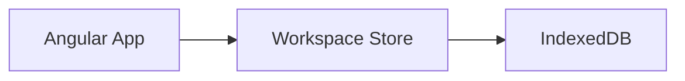

# Product Requirements Document — Local Technical Markdown Workspace

**Document:** PRD.md  
**Product Type:** Browser-based local-first technical Markdown workspace  
**Primary Platform:** Desktop web browser  
**Frontend:** Angular SPA  
**Backend:** None  
**Server Database:** None  
**Local Persistence:** Browser-local IndexedDB + lightweight UI preferences  
**Mermaid Baseline:** 11.17.2 (exactly pinned for V1)  
**Status:** Implementation-ready draft  
**Priority:** V1

---

## 1. Product Summary

Build a local-first web application for importing, organizing, reading, editing, searching, and exporting Markdown documents entirely in the browser.

The application is intended primarily for technical documentation such as:

- Product Requirement Documents (PRD)
- architecture documents
- technical specifications
- implementation plans
- engineering notes
- API documentation
- ADR-like documents
- AI-generated Markdown from tools such as coding agents
- project knowledge documents

The product is not merely a Markdown renderer. Its primary mental model is a **local technical documentation workspace**.

```text
Technical Markdown Workspace
├── Resource Management
│   ├── Sections / Projects
│   ├── Documents
│   ├── Import
│   ├── Search
│   ├── Reorder
│   └── Move
├── Markdown Viewer
│   ├── Markdown / GFM-style content
│   ├── Code highlighting
│   ├── Tables
│   ├── Document outline
│   └── Mermaid diagrams
├── Markdown Editor
│   ├── Raw Markdown editing
│   ├── Syntax highlighting
│   ├── Live preview
│   └── Autosave
└── Local Persistence
    ├── IndexedDB
    └── UI preferences
```

---

## 2. Product Positioning

> A local-first technical Markdown workspace for importing, organizing, reading, editing, searching, and visualizing Markdown documents and Mermaid diagrams entirely in the browser.

The product MUST NOT require:

- authentication
- backend API
- external database service
- cloud account
- server-side file storage
- collaboration service

The application MUST be deployable as a static Angular SPA.

---

## 3. Goals

### 3.1 Primary Goals

The product MUST allow users to:

1. import one or many Markdown files;
2. organize documents into logical sections/projects;
3. navigate documents quickly;
4. read Markdown in a viewer-dominant layout;
5. edit raw Markdown without leaving the workspace;
6. see live preview while editing;
7. render technical Mermaid diagrams inline;
8. search filenames and document content;
9. persist workspace data locally;
10. export documents back to `.md` files;
11. work without any application backend.

### 3.2 Quality Goals

The application SHOULD feel closer to a lightweight technical-documentation reader/editor than a generic CMS or note-taking platform.

The default experience MUST prioritize reading over editing.

---

## 4. Non-Goals / Out of Scope for V1

The following are explicitly outside V1:

- backend services
- user authentication
- multi-user collaboration
- cloud synchronization
- comments/review workflow
- Git integration
- GitHub/GitLab integration
- automatic repository synchronization
- native filesystem watching
- document version history
- WYSIWYG editing
- plugin marketplace
- AI assistant
- AI generation
- backlinks
- knowledge graph
- multi-workspace management
- PlantUML rendering
- first-class UML Use Case syntax
- automatic local image/folder asset ingestion

Use-case-style diagrams MAY be represented using Mermaid flowcharts.

---

## 5. Core Concepts

### 5.1 Workspace

V1 has exactly one logical local workspace.

```text
Local Workspace
├── Unassigned
├── Project 1
├── Project 2
└── Project N
```

Multiple separate workspaces are deferred.

### 5.2 Section

A Section is a logical grouping of Markdown documents.

Examples:

```text
Project 1
├── fitur-a.md
├── fitur-b.md
└── architecture.md

Project 2
├── fitur-x.md
└── roadmap.md
```

A Section is NOT required to map to a physical filesystem folder.

### 5.3 Unassigned Section

The workspace MUST always contain a special `Unassigned` section.

Rules:

- cannot be deleted;
- cannot be renamed;
- receives files imported without a destination;
- receives documents moved out of a deleted section when the user chooses preservation;
- acts as a safe fallback destination.

### 5.4 Document

A Document is an imported or locally created Markdown resource stored as workspace data.

The imported file on the user's filesystem is NOT the live source of truth after import.

```text
Original local file
      ↓ import
Workspace document copy
      ↓ edit/autosave
Browser-local persistence
```

Editing a document MUST NOT silently overwrite the original filesystem file.

---

## 6. Target Users

Primary users:

- software developers
- technical leads
- software architects
- product managers working with technical teams
- AI-assisted developers
- users who regularly review PRDs/specifications in Markdown

Typical documents may be large and may contain many headings, tables, code blocks, and technical diagrams.

---

## 7. Primary User Flows

### 7.1 Import and Read

```text
Open App
  ↓
Import Markdown
  ↓
Choose one or multiple files
  ↓
Choose / infer destination section
  ↓
Select document
  ↓
Read in Markdown Viewer
```

### 7.2 Drag and Drop Import

```text
Drag .md files
  ↓
Drop onto a Section
  ↓
Files imported directly to that Section
```

If dropped on the general workspace dropzone:

```text
Files
  ↓
Unassigned
```

### 7.3 Edit with Live Preview

```text
Select Document
  ↓
Open / expand Editor
  ↓
Edit Markdown
  ↓
Debounced state update
  ↓
Viewer rerenders
  ↓
Autosave locally
```

### 7.4 Reorganize Documents

```text
Drag Document
Project 1 → Project 2
```

The move MUST persist after reload.

### 7.5 Export

```text
Select Document
  ↓
Export
  ↓
Download current Markdown content as .md
```

Section and multi-document export MUST create a ZIP archive.

---

## 8. Application Layout

### 8.1 Main Layout

The application MUST use a three-panel desktop layout:

```text
┌────────────────────────────────────────────────────────────────────────────┐
│ Header / Workspace Actions                                                 │
├──────────────────┬───────────────────────────────────────┬─────────────────┤
│ Resources        │ Markdown Viewer                       │ Markdown Editor │
│                  │                                       │                 │
│ Sections         │ Primary reading surface               │ Raw Markdown    │
│ Documents        │                                       │                 │
│ Search           │                                       │                 │
│ Outline tab      │                                       │                 │
│                  │                                       │                 │
├──────────────────┴───────────────────────────────────────┴─────────────────┤
│ Optional status area                                                       │
└────────────────────────────────────────────────────────────────────────────┘
```

### 8.2 Viewer Dominance

The Markdown Viewer MUST be the largest/default central panel.

Recommended default sizing:

```text
Resources: ~260–300px
Viewer:    remaining dominant width
Editor:    ~300–360px
```

Equivalent proportional target:

```text
Resources  18–22%
Viewer     55–62%
Editor     20–25%
```

### 8.3 Resizable Panels

Users MUST be able to resize:

- Resources ↔ Viewer
- Viewer ↔ Editor

Panel sizes MUST persist locally.

Each panel MUST have a minimum width to avoid unusable layouts.

### 8.4 Panel Modes

V1 MUST provide:

- Viewer + Resources + Editor
- Viewer dominant / Editor collapsed
- Viewer only
- Editor only
- Viewer + Editor

The default mode is viewer-dominant.

### 8.5 Desktop-First

Primary target resolution:

- optimized for ≥1280 px viewport width;
- usable at approximately 1024 px;
- mobile-specific three-panel UX is not required for V1.

---

## 9. Header Requirements

The header SHOULD expose compact actions such as:

- Import Markdown
- New Section
- Export
- Layout mode
- Theme
- More actions

The header MUST not compete visually with document content.

---

## 10. Resource Panel

### 10.1 Resource Panel Capabilities

The Resource Panel MUST support:

- section list;
- document list per section;
- expand/collapse sections;
- create section;
- rename section;
- delete section;
- reorder sections;
- rename document;
- delete document;
- reorder documents within a section;
- move documents across sections;
- drag-and-drop file import;
- filename search;
- full-text search;
- Files / Outline views or tabs.

### 10.2 Section Actions

Section actions:

- Create
- Rename
- Delete
- Reorder
- Expand
- Collapse

Deleting a non-empty section MUST ask the user to choose:

1. move documents to `Unassigned`; or
2. delete section and contained documents.

Default/safest option SHOULD be `Move to Unassigned`.

### 10.3 Document Actions

Document actions:

- Open
- Rename
- Move
- Reorder
- Export
- Delete

Document deletion MUST require confirmation.

### 10.4 Duplicate Filenames

Rules:

- duplicate filenames MAY exist in different sections;
- duplicate filenames SHOULD NOT exist in the same section without conflict resolution.

Conflict choices:

- Replace
- Keep Both
- Cancel

`Keep Both` MAY generate names such as:

```text
prd.md
prd (1).md
prd (2).md
```

---

## 11. Markdown Import

### 11.1 Terminology

The product SHOULD use the term `Import` rather than `Upload`, because files remain local and are not sent to a server.

### 11.2 Supported Input

V1 MUST support:

- `.md`
- `.markdown` SHOULD be supported when straightforward
- single file selection
- multiple file selection
- drag and drop

### 11.3 Import Destination

Import destination options:

- Unassigned
- existing Section
- new Section

Dropping directly on a Section SHOULD bypass an extra destination dialog.

### 11.4 Invalid Input

Unsupported files MUST be rejected gracefully and MUST NOT break an otherwise valid multi-file import.

The UI SHOULD report:

- imported count;
- skipped count;
- conflicts;
- invalid file types.

---

## 12. Markdown Viewer

### 12.1 Required Markdown Rendering

The viewer MUST support at minimum:

- H1–H6 headings
- paragraphs
- bold
- italic
- strikethrough where parser supports GFM behavior
- ordered lists
- unordered lists
- nested lists
- task lists
- blockquotes
- links
- inline code
- fenced code blocks
- syntax highlighting for common programming languages
- horizontal rules
- Markdown tables
- escaped Markdown characters
- heading anchors

### 12.2 Raw HTML

Raw HTML inside Markdown SHOULD be disabled or strictly sanitized by default.

No Markdown content may execute arbitrary JavaScript.

### 12.3 Links

External links MUST use safe handling.

At minimum:

- reject `javascript:` URLs;
- external links SHOULD open with safe `rel` attributes;
- unsafe schemes MUST NOT execute.

### 12.4 Images

Remote HTTPS Markdown images MAY render.

Physical relative image asset importing is outside V1 unless separately implemented.

A missing image MUST not break document rendering.

---

## 13. Document Outline / Table of Contents

The application MUST derive an outline from Markdown headings.

Example:

```text
Overview
Problem
Goals
Functional Requirements
Architecture
Acceptance Criteria
```

Requirements:

- nested heading hierarchy;
- click heading to scroll viewer;
- active heading MAY be highlighted based on scroll position;
- outline SHOULD live inside the Resources panel as a tab/view rather than requiring a permanent fourth panel.

---

## 14. Markdown Editor

### 14.1 Editor Scope

The editor is a raw Markdown editor, not WYSIWYG.

Recommended implementation direction: CodeMirror 6 or an equivalently lightweight browser editor.

### 14.2 Required Capabilities

The editor MUST provide:

- Markdown syntax highlighting;
- multiline editing;
- undo/redo;
- keyboard navigation;
- search within document;
- sensible indentation;
- code-font rendering;
- live viewer update;
- autosave;
- selection preservation during normal rerenders.

Line numbers MAY be configurable.

### 14.3 Live Preview

Editor changes MUST update the viewer after a short debounce.

Recommended interaction target:

```text
edit
↓
~250–500 ms debounce
↓
update active document state
↓
rerender Markdown
↓
persist asynchronously
```

### 14.4 Save State

The application SHOULD expose small non-blocking states such as:

- Editing
- Saving locally…
- Saved locally
- Save failed

Manual Save MAY exist as a shortcut but MUST NOT be the only persistence mechanism.

---

## 15. Mermaid Rendering

### 15.1 Mermaid as First-Class Content

The viewer MUST detect fenced Markdown blocks with language `mermaid`:

````markdown

````

and render the block as a diagram.

### 15.2 Baseline Version

V1 MUST pin Mermaid to exact version:

```text
11.17.2
```

Reason:

- renderer behavior must be deterministic;
- sample fixtures must remain reproducible;
- multiple Mermaid diagram types are relatively new and may evolve.

Dependency upgrades MUST run the Mermaid fixture regression suite before release.

### 15.3 Supported Diagram Contract

The application MUST support every diagram family supported by the pinned Mermaid version where the runtime parser supports it.

Baseline diagram families for Mermaid 11.17.2:

1. Flowchart
2. Swimlanes
3. Sequence Diagram
4. Class Diagram
5. State Diagram
6. Entity Relationship Diagram
7. User Journey
8. Gantt
9. Pie Chart
10. Quadrant Chart
11. Requirement Diagram
12. GitGraph
13. C4 Diagram
14. Mindmap
15. Timeline
16. ZenUML
17. Sankey
18. XY Chart
19. Block Diagram
20. Packet Diagram
21. Kanban
22. Architecture Diagram
23. Radar Diagram
24. Event Modeling
25. Treemap
26. Venn
27. Ishikawa
28. Wardley Map
29. Cynefin Framework Diagram
30. TreeView

C4 additionally exposes multiple chart forms such as System Context, Container, Component, Dynamic, and Deployment diagrams.

### 15.4 Mermaid Rendering Pipeline

```text
Markdown Source
      ↓
Markdown Parser
      ↓
AST / rendered nodes
      ├── standard Markdown → sanitized HTML
      └── mermaid fence
              ↓
         Mermaid Renderer
              ↓
             SVG
              ↓
          Viewer Block
```

### 15.5 Mermaid Live Preview

When editing a Mermaid block:

```text
Editor
  ↓
Markdown update
  ↓
Mermaid block changes
  ↓
Debounced rerender
  ↓
Updated SVG
```

A malformed diagram MUST NOT prevent the rest of the Markdown document from rendering.

### 15.6 Diagram Error Isolation

For invalid Mermaid syntax, show a localized error block similar to:

```text
┌──────────────────────────────────────────────┐
│ Mermaid diagram could not be rendered       │
│                                              │
│ Syntax error near line N                     │
│                                              │
│ [View Source]                                │
└──────────────────────────────────────────────┘
```

Requirements:

- only the invalid diagram fails;
- surrounding Markdown remains visible;
- raw source remains accessible;
- user can continue editing.

### 15.7 Diagram Controls

Each rendered Mermaid block SHOULD support:

- zoom in;
- zoom out;
- pan when diagram exceeds container;
- fit to container;
- reset zoom;
- fullscreen;
- Diagram / Source toggle.

These controls are especially important for:

- ERD
- class diagrams
- architecture diagrams
- sequence diagrams
- C4 diagrams
- large flowcharts

### 15.8 Mermaid Theme

Diagram rendering SHOULD follow application theme:

```text
Light app → light-compatible Mermaid theme
Dark app  → dark-compatible Mermaid theme
```

Theme changes MUST NOT mutate document source.

### 15.9 Mermaid Security

Mermaid MUST be configured defensively.

Requirements:

- no arbitrary JavaScript execution;
- use Mermaid safe/strict security configuration;
- sanitize generated content where applicable;
- unsafe link schemes MUST NOT execute;
- Mermaid rendering errors MUST be caught.

---

## 16. Search

### 16.1 Filename Search

The Resource Panel MUST support fast filtering by filename.

### 16.2 Full-Text Search

V1 MUST support search across document content.

Results SHOULD show:

- filename;
- section;
- matched snippet;
- match count when practical.

Clicking a result MUST open the corresponding document.

A lightweight in-memory index or direct content search is acceptable for V1; a server search engine is forbidden by product constraints.

---

## 17. Export

### 17.1 Current Document

The user MUST be able to export the current workspace version as `.md`.

### 17.2 Section Export

The user MUST be able to export a section as a ZIP containing its Markdown documents.

### 17.3 Workspace / Multi-Document Export

The user SHOULD be able to export selected documents or all documents as ZIP.

Suggested ZIP hierarchy:

```text
workspace-export.zip
├── Unassigned/
├── Project 1/
│   ├── prd.md
│   └── architecture.md
└── Project 2/
    └── roadmap.md
```

Export MUST use current edited content, not the originally imported bytes.

---

## 18. Theme and Appearance

V1 MUST support:

- Light
- Dark
- System preference

Theme preference MUST persist locally.

Viewer typography SHOULD prioritize readability for long technical documents.

---

## 19. Keyboard Shortcuts

V1 SHOULD support common shortcuts such as:

| Action | Suggested Shortcut |
|---|---|
| Import | Ctrl/Cmd + O |
| Search resources | Ctrl/Cmd + P or configurable |
| Search current document | Ctrl/Cmd + F |
| Toggle editor | Ctrl/Cmd + E |
| Viewer-only mode | configurable |
| Export current document | Ctrl/Cmd + Shift + S |
| Save state immediately | Ctrl/Cmd + S |

Keyboard shortcuts MUST not conflict destructively with browser/editor expectations.

---

## 20. Persistence and Storage

### 20.1 Constraint Clarification

The product has **no backend database** and **no database service**.

Browser-local IndexedDB is permitted as local application persistence.

### 20.2 Storage Responsibility

Persisted document data includes:

- sections;
- section order;
- documents;
- document content;
- document order;
- active/last-open document id;
- timestamps;
- optional source metadata.

Persisted UI state includes:

- panel sizes;
- collapsed sections;
- layout mode;
- theme;
- last active resource-panel tab.

### 20.3 State Separation

Implementation MUST conceptually separate:

```text
Session State
├── active selection
├── hover state
├── drag state
└── transient dialogs

Persistent UI State
├── panel sizes
├── theme
├── collapsed sections
└── last opened document

Document State
├── sections
├── documents
├── content
└── ordering
```

### 20.4 Storage Failure

The application MUST handle:

- IndexedDB unavailable;
- write failure;
- storage quota failure;
- corrupted/invalid stored records where recoverable.

A save failure MUST be surfaced to the user rather than silently discarded.

---

## 21. Suggested Data Model

Exact field names MAY change during implementation, but semantics should remain.

```ts
interface Section {
  id: string;
  name: string;
  order: number;
  isSystem: boolean;
  collapsed: boolean;
  createdAt: string;
  updatedAt: string;
}

interface MarkdownDocument {
  id: string;
  sectionId: string;
  fileName: string;
  title?: string;
  content: string;
  order: number;
  sourceType: 'imported' | 'created';
  createdAt: string;
  updatedAt: string;
}

interface WorkspacePreferences {
  theme: 'light' | 'dark' | 'system';
  resourcePanelWidth: number;
  editorPanelWidth: number;
  layoutMode: string;
  activeDocumentId?: string;
}
```

No identity, account, or remote tenant model is required.

---

## 22. Angular Architecture Constraints

Recommended architecture:

```text
UI Components
      ↓
Feature Stores / Services using Angular Signals
      ↓
Workspace Repository Abstraction
      ↓
IndexedDB Adapter
```

Recommended feature organization:

```text
src/app/
├── core/
│   ├── storage/
│   ├── models/
│   ├── security/
│   └── services/
├── features/
│   ├── workspace/
│   ├── resources/
│   ├── import/
│   ├── export/
│   ├── markdown-viewer/
│   ├── markdown-editor/
│   ├── search/
│   └── settings/
├── shared/
│   ├── components/
│   ├── directives/
│   └── utils/
└── app.component.*
```

### 22.1 State Management

Use Angular Signals/services for V1 unless implementation demonstrates a concrete need for a heavier global state framework.

NgRx is not required by this PRD.

### 22.2 Suggested Dependency Direction

The following are implementation suggestions, not mandatory brand requirements:

- Markdown parser: `markdown-it`, `marked`, or equivalent mature parser;
- Mermaid: exact `11.17.2` for V1 baseline;
- Editor: CodeMirror 6 or equivalent lightweight editor;
- resource drag/drop: Angular CDK or equivalent;
- syntax highlighting: highlight.js or equivalent;
- ZIP export: JSZip or equivalent;
- local persistence abstraction: native IndexedDB or a small wrapper;
- HTML sanitation: Angular-safe sanitation plus a robust sanitizer where required.

Dependency count and bundle size SHOULD remain conservative.

---

## 23. Security Requirements

Imported Markdown MUST be treated as untrusted input.

The application MUST defend against:

- inline script execution;
- event-handler injection;
- `javascript:` links;
- unsafe HTML;
- malicious SVG/HTML insertion through rendering paths;
- unsafe Mermaid callbacks/configuration;
- DOM XSS through viewer rendering.

No user document should gain arbitrary JavaScript execution privileges.

Security controls MUST be tested using malicious fixture content.

---

## 24. Performance Requirements

The application SHOULD remain responsive with a realistic technical workspace.

Baseline targets for normal modern desktop hardware:

- importing tens of Markdown files should not freeze the page for prolonged periods;
- switching normal documents should feel immediate;
- text editing should remain responsive;
- Mermaid rerendering should be debounced;
- a large/invalid Mermaid diagram should not block the entire application;
- viewer rerenders SHOULD avoid rebuilding unrelated panels;
- search SHOULD avoid unnecessary repeated full scans on every keystroke where dataset size makes it noticeable.

Exact performance thresholds MAY be established after an initial benchmark fixture exists.

---

## 25. Accessibility Requirements

V1 SHOULD support:

- keyboard access for primary actions;
- visible focus state;
- semantic buttons and controls;
- accessible labels for icon-only controls;
- sufficient contrast in light/dark themes;
- resizable content without loss of core functionality;
- meaningful diagram container labels where possible.

---

## 26. Empty States

### 26.1 Empty Workspace

Show a prominent but lightweight area:

```text
Drop Markdown files here
or
[Choose Files]

+ Create Section
```

### 26.2 No Active Document

The Viewer SHOULD show instructions rather than an empty blank surface.

### 26.3 Search No Results

Show the search term and clear/reset action.

---

## 27. Error Handling

The application MUST provide recoverable UI for:

- invalid Markdown import file type;
- duplicate document conflict;
- IndexedDB failure;
- export failure;
- Mermaid parse/render error;
- large document/render exception;
- unsupported URL scheme;
- corrupted local record.

A local error in one document MUST NOT crash the entire workspace.

---

## 28. Example / Regression Fixture Requirement

The repository MUST include:

```text
markdown-viewer-example.md
```

This file is a first-class product fixture and MUST contain examples for:

### Standard Markdown

- headings H1–H6
- paragraphs
- bold/italic/strikethrough
- links
- blockquotes
- ordered/unordered/nested lists
- task lists
- inline code
- fenced code blocks
- syntax-highlightable code
- horizontal rules
- Markdown table
- long text
- escaped characters

### Mermaid

At least one renderable source block for every Mermaid 11.17.2 diagram family listed in section 15.3.

The fixture SHOULD additionally include all five C4 chart forms.

The fixture MAY include a clearly labeled intentionally invalid Mermaid block to verify error isolation.

---

## 29. Mermaid Upgrade Gate

Any Mermaid version upgrade MUST run these checks before release:

1. import `markdown-viewer-example.md`;
2. render every expected diagram fixture;
3. verify no supported diagram regressed;
4. verify malformed Mermaid remains isolated;
5. verify light/dark rendering;
6. verify zoom/pan/fit/fullscreen controls;
7. verify source/diagram toggle;
8. verify no security regression;
9. update fixture syntax if the new pinned version deliberately changes a beta diagram grammar;
10. document the new pinned Mermaid version.

Do not use a floating Mermaid dependency version in production builds.

---

## 30. Acceptance Criteria

### 30.1 Import

- [ ] User can choose a single `.md` file.
- [ ] User can choose multiple `.md` files.
- [ ] User can drag one or multiple Markdown files into the app.
- [ ] Dropping onto a section imports into that section.
- [ ] Dropping into the general workspace imports into `Unassigned`.
- [ ] Unsupported files do not break valid files in the same batch.

### 30.2 Sections and Documents

- [ ] User can create, rename, reorder, expand, collapse, and delete sections.
- [ ] `Unassigned` cannot be deleted or renamed.
- [ ] User can move/reorder documents with drag and drop.
- [ ] Resource ordering survives reload.
- [ ] Duplicate-name conflicts are handled explicitly.

### 30.3 Viewer

- [ ] Standard Markdown fixture renders correctly.
- [ ] Tables render correctly.
- [ ] Code blocks render with syntax highlighting where language is supported.
- [ ] Long documents remain readable.
- [ ] Heading anchors and outline navigation work.

### 30.4 Mermaid

- [ ] Mermaid fenced blocks render inline.
- [ ] Every Mermaid family in the pinned fixture renders as expected.
- [ ] C4 fixture forms supported by Mermaid render.
- [ ] Invalid Mermaid only fails its own block.
- [ ] Diagram source can be viewed.
- [ ] Large diagrams can be zoomed/panned/fitted.
- [ ] Fullscreen diagram view works.
- [ ] Theme switching does not alter source Markdown.

### 30.5 Editor

- [ ] Raw Markdown can be edited.
- [ ] Viewer updates from edited content.
- [ ] Mermaid changes rerender live after debounce.
- [ ] Autosave persists edits.
- [ ] Reload restores saved content.

### 30.6 Search

- [ ] Filename search filters resources.
- [ ] Full-text search returns matching documents.
- [ ] Search result opens the correct document.

### 30.7 Export

- [ ] Current document exports as Markdown.
- [ ] Exported document contains current edited content.
- [ ] Section export produces a ZIP.
- [ ] Multi-document/workspace export preserves logical section hierarchy where applicable.

### 30.8 Layout

- [ ] Resource, Viewer, and Editor widths are adjustable.
- [ ] Viewer is dominant by default.
- [ ] Panel sizes survive reload.
- [ ] Viewer-only and Editor-only modes work.
- [ ] Editor can be collapsed.

### 30.9 Security

- [ ] Script tags do not execute.
- [ ] inline event handlers do not execute.
- [ ] `javascript:` URLs do not execute.
- [ ] Mermaid does not enable arbitrary JS execution.
- [ ] rendering malicious Markdown does not compromise the application shell.

---

## 31. Suggested Implementation Phases

### Phase 1 — Application Shell and Persistence

- Angular shell
- layout system
- Signals-based workspace state
- IndexedDB repository
- preferences persistence
- Unassigned section

### Phase 2 — Resource Management and Import

- single/multi-file import
- drag/drop import
- sections
- document actions
- reorder/move
- duplicate handling

### Phase 3 — Markdown Viewer

- Markdown parser
- sanitized rendering
- tables
- code highlighting
- heading anchors
- outline

### Phase 4 — Mermaid Integration

- Mermaid 11.17.2 pin
- fenced block detection
- isolated renderer
- error handling
- theme support
- zoom/pan/fit/fullscreen
- source/diagram toggle
- fixture coverage

### Phase 5 — Editor and Live Preview

- Markdown editor
- live preview
- Mermaid live rerender
- autosave
- save state

### Phase 6 — Search, Export, Productivity

- filename search
- full-text search
- single export
- ZIP export
- keyboard shortcuts
- layout modes
- dark/light/system theme

### Phase 7 — Hardening and Release Gate

- regression fixture
- malicious input tests
- storage failure tests
- large document tests
- Mermaid diagram matrix verification
- accessibility pass
- bundle/performance check

---

## 32. Definition of Done for V1

V1 is done only when:

```text
Import
+
Organization
+
Viewer
+
Mermaid
+
Editor
+
Local Persistence
+
Search
+
Export
+
Resizable UX
+
Security
+
Regression Fixture
```

work together as a coherent local-first product.

A build that merely renders Markdown but does not reliably persist organization, edit content, render the pinned Mermaid fixture, isolate malformed diagrams, and export current content is NOT V1 complete.

---

## 33. Reference Baseline

Mermaid official syntax reference used to establish the V1 diagram matrix:

- https://mermaid.js.org/intro/syntax-reference.html
- https://mermaid.js.org/syntax/flowchart.html
- https://mermaid.js.org/syntax/swimlanes.html
- https://mermaid.js.org/syntax/c4.html
- https://mermaid.js.org/syntax/architecture.html
- https://mermaid.js.org/syntax/eventmodeling.html
- https://mermaid.js.org/syntax/treemap.html
- https://mermaid.js.org/syntax/venn.html
- https://mermaid.js.org/syntax/ishikawa.html
- https://mermaid.js.org/syntax/wardley.html
- https://mermaid.js.org/syntax/cynefin.html
- https://mermaid.js.org/syntax/treeView.html

The Mermaid version MUST remain pinned until a deliberate upgrade passes the regression gate.
