# Markdown Viewer Complete Example

> **Purpose:** This file is a visual and regression fixture for the Local Technical Markdown Workspace. It exercises common Markdown constructs plus every Mermaid diagram family listed by the pinned Mermaid `11.17.2` syntax reference.

---

## 1. Typography

# Heading 1 Example
## Heading 2 Example
### Heading 3 Example
#### Heading 4 Example
##### Heading 5 Example
###### Heading 6 Example

This is a normal paragraph. It contains **bold text**, *italic text*, ***bold italic text***, and ~~strikethrough text~~.

Inline code looks like `const workspace = signal(initialState);`.

Escaped Markdown characters: \*not italic\*, \# not a heading, and \`not inline code\`.

A useful external link: [Mermaid documentation](https://mermaid.js.org/).

---

## 2. Blockquote

> Technical documentation should remain readable even when it contains long explanations.
>
> > Nested blockquotes should also render correctly.

---

## 3. Lists

### Unordered

- Angular SPA
- Local persistence
  - IndexedDB
  - UI preferences
- Markdown rendering
  - Tables
  - Code
  - Mermaid

### Ordered

1. Import files
2. Organize into sections
3. Read
4. Edit
5. Export

### Task List

- [x] Import Markdown
- [x] Render Markdown
- [x] Render Mermaid
- [ ] Ship the application

---

## 4. Markdown Table

| Feature | Priority | V1 | Notes |
|---|---:|:---:|---|
| Multi-file import | P0 | ✅ | Choose or drag/drop |
| Section management | P0 | ✅ | Create, rename, reorder, delete |
| Markdown viewer | P0 | ✅ | Viewer-dominant layout |
| Mermaid renderer | P0 | ✅ | Pinned Mermaid version |
| Full-text search | P1 promoted | ✅ | Browser-local |
| Cloud sync | Out of scope | ❌ | No backend |

---

## 5. Code Blocks

### TypeScript

```typescript
interface MarkdownDocument {
  id: string;
  sectionId: string;
  fileName: string;
  content: string;
  updatedAt: string;
}

const updateDocument = (doc: MarkdownDocument, content: string): MarkdownDocument => ({
  ...doc,
  content,
  updatedAt: new Date().toISOString(),
});
```

### JSON

```json
{
  "theme": "system",
  "viewerDominant": true,
  "autosave": true
}
```

### Bash

```bash
npm install
npm run start
```

---

## 6. Horizontal Rule

Content above.

---

Content below.

---

# Mermaid Diagram Matrix

The following blocks are intended to render using Mermaid `11.17.2`.

Some Mermaid diagram families are marked beta/experimental by Mermaid and may evolve in future releases. This fixture therefore assumes the project pins Mermaid to the specified baseline version.

---

## 7. Flowchart

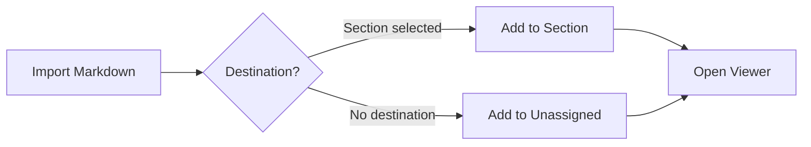
```mermaid
flowchart LR
    A[Import Markdown] --> B{Destination?}
    B -->|Section selected| C[Add to Section]
    B -->|No destination| D[Add to Unassigned]
    C --> E[Open Viewer]
    D --> E
```

### Use-Case-Style Flowchart

Mermaid does not have a separate first-class UML Use Case diagram grammar. A use-case-style visualization can be modeled with flowchart syntax.

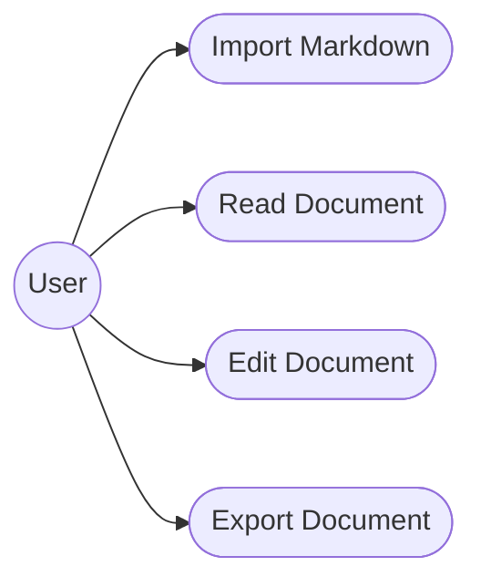
```mermaid
flowchart LR
    User((User))
    UC1([Import Markdown])
    UC2([Read Document])
    UC3([Edit Document])
    UC4([Export Document])

    User --> UC1
    User --> UC2
    User --> UC3
    User --> UC4
```

---

## 8. Swimlanes

```mermaid
swimlane-beta LR
    subgraph User[User]
        A[Choose Markdown]
        D[Read Document]
    end

    subgraph Workspace[Workspace]
        B[Import File]
        C[Persist Document]
    end

    A -->|file| B
    B --> C
    C --> D
```

---

## 9. Sequence Diagram

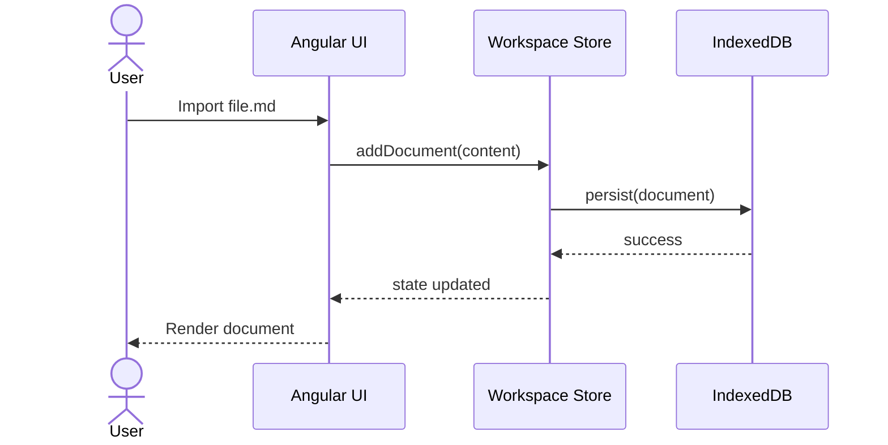
```mermaid
sequenceDiagram
    actor User
    participant UI as Angular UI
    participant Store as Workspace Store
    participant DB as IndexedDB

    User->>UI: Import file.md
    UI->>Store: addDocument(content)
    Store->>DB: persist(document)
    DB-->>Store: success
    Store-->>UI: state updated
    UI-->>User: Render document
```

---

## 10. Class Diagram

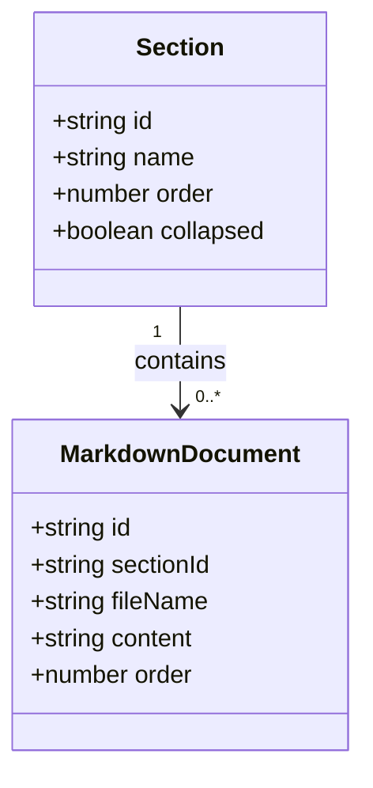
```mermaid
classDiagram
    class Section {
      +string id
      +string name
      +number order
      +boolean collapsed
    }

    class MarkdownDocument {
      +string id
      +string sectionId
      +string fileName
      +string content
      +number order
    }

    Section "1" --> "0..*" MarkdownDocument : contains
```

---

## 11. State Diagram

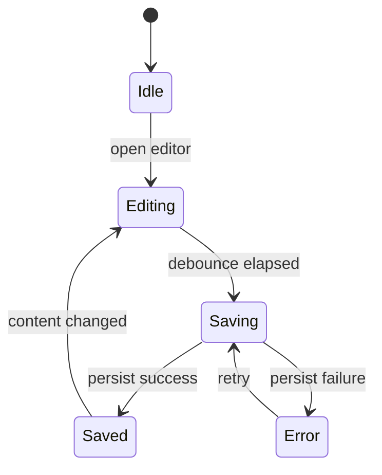
```mermaid
stateDiagram-v2
    [*] --> Idle
    Idle --> Editing : open editor
    Editing --> Saving : debounce elapsed
    Saving --> Saved : persist success
    Saving --> Error : persist failure
    Saved --> Editing : content changed
    Error --> Saving : retry
```

---

## 12. Entity Relationship Diagram

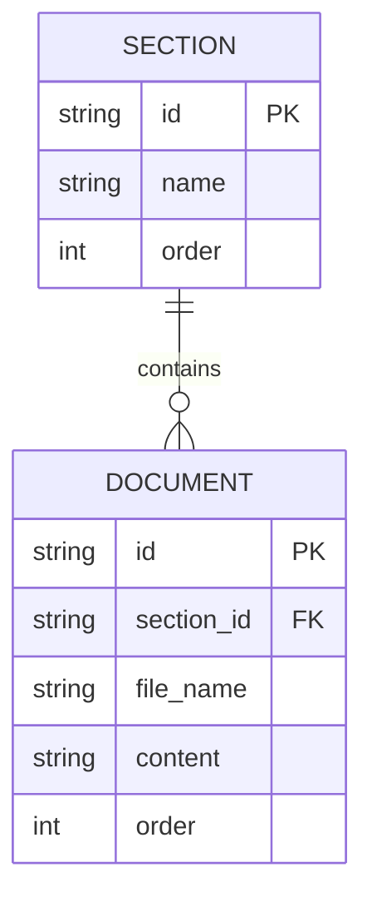
```mermaid
erDiagram
    SECTION ||--o{ DOCUMENT : contains

    SECTION {
        string id PK
        string name
        int order
    }

    DOCUMENT {
        string id PK
        string section_id FK
        string file_name
        string content
        int order
    }
```

---

## 13. User Journey

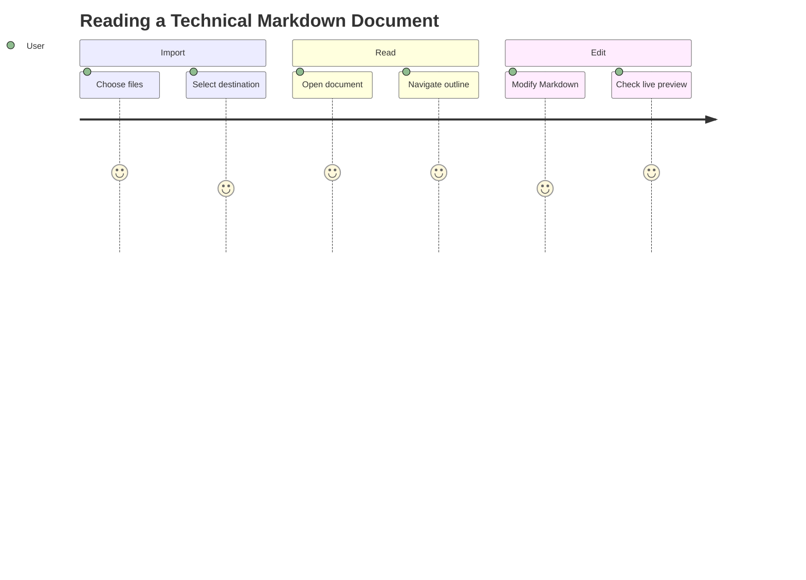
```mermaid
journey
    title Reading a Technical Markdown Document
    section Import
      Choose files: 5: User
      Select destination: 4: User
    section Read
      Open document: 5: User
      Navigate outline: 5: User
    section Edit
      Modify Markdown: 4: User
      Check live preview: 5: User
```

---

## 14. Gantt

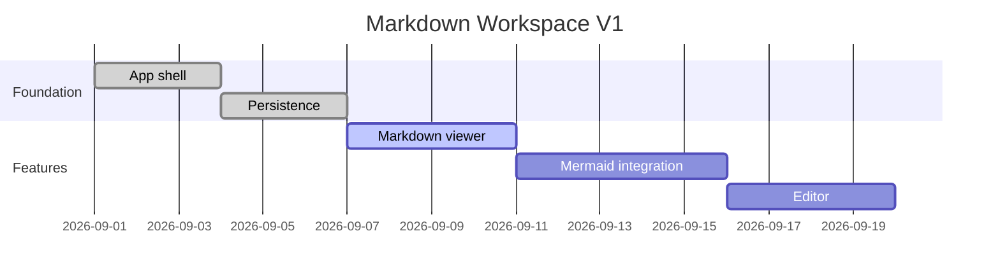
```mermaid
gantt
    title Markdown Workspace V1
    dateFormat  YYYY-MM-DD
    section Foundation
    App shell           :done, a1, 2026-09-01, 3d
    Persistence         :done, a2, after a1, 3d
    section Features
    Markdown viewer     :active, b1, after a2, 4d
    Mermaid integration :b2, after b1, 5d
    Editor              :b3, after b2, 4d
```

---

## 15. Pie Chart

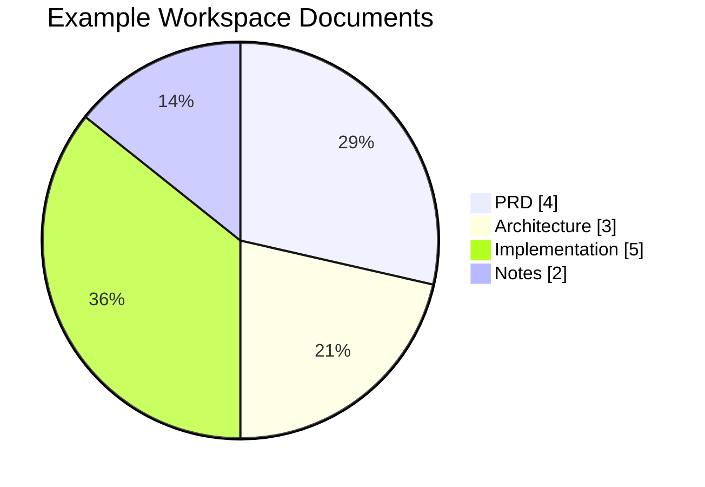
```mermaid
pie showData
    title Example Workspace Documents
    "PRD" : 4
    "Architecture" : 3
    "Implementation" : 5
    "Notes" : 2
```

---

## 16. Quadrant Chart

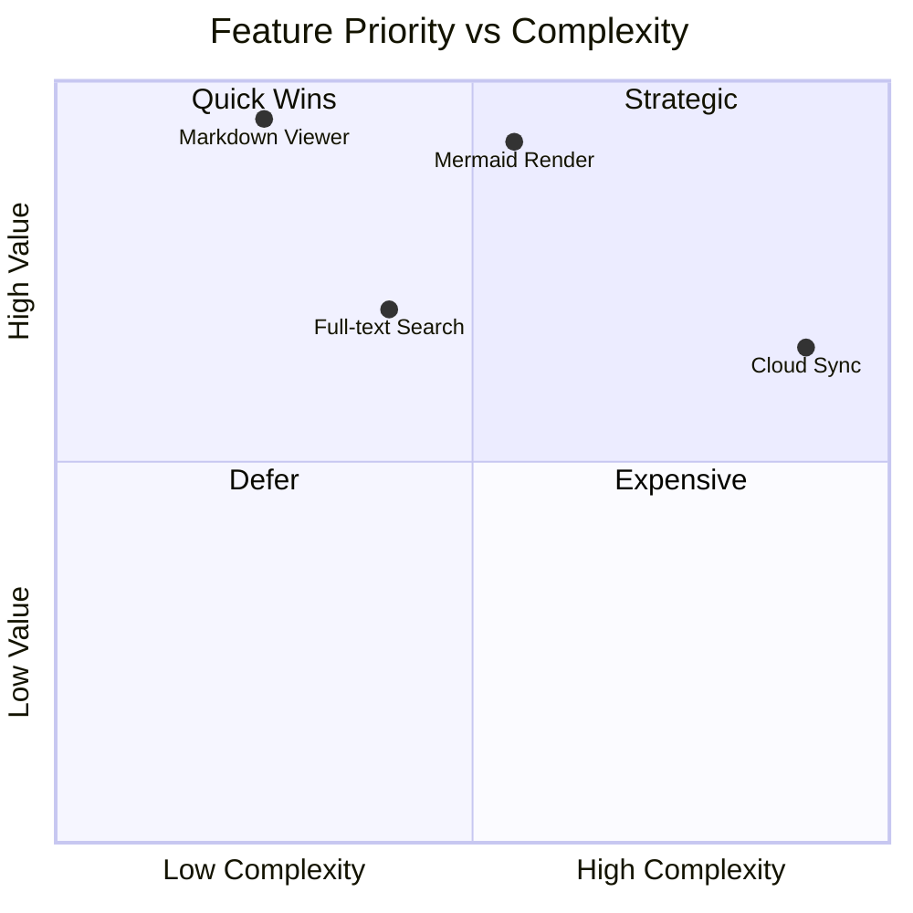
```mermaid
quadrantChart
    title Feature Priority vs Complexity
    x-axis Low Complexity --> High Complexity
    y-axis Low Value --> High Value
    quadrant-1 Strategic
    quadrant-2 Quick Wins
    quadrant-3 Defer
    quadrant-4 Expensive
    Markdown Viewer: [0.25, 0.95]
    Mermaid Render: [0.55, 0.92]
    Full-text Search: [0.40, 0.70]
    Cloud Sync: [0.90, 0.65]
```

---

## 17. Requirement Diagram

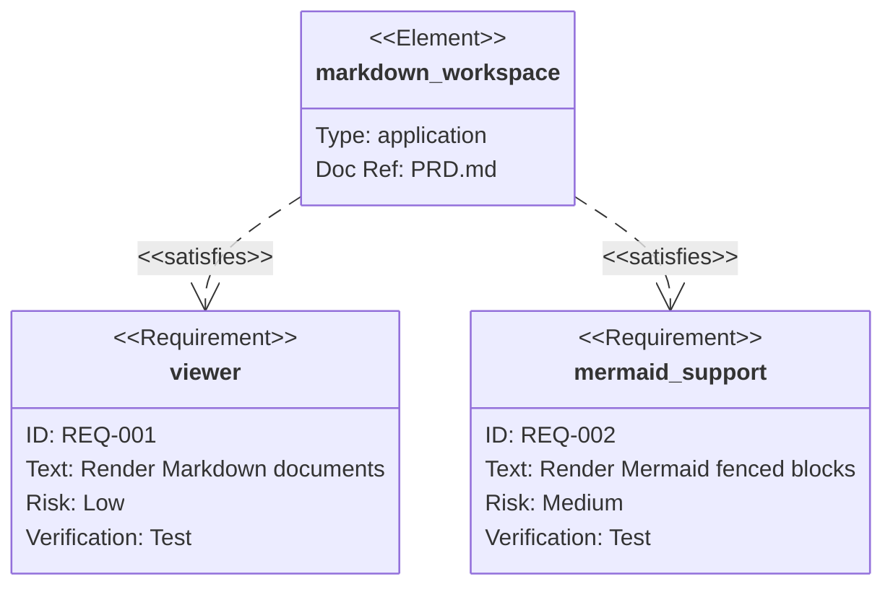
```mermaid
requirementDiagram
    requirement viewer {
        id: "REQ-001"
        text: Render Markdown documents
        risk: low
        verifyMethod: test
    }

    requirement mermaid_support {
        id: "REQ-002"
        text: Render Mermaid fenced blocks
        risk: medium
        verifyMethod: test
    }

    element markdown_workspace {
        type: application
        docref: "PRD.md"
    }

    markdown_workspace - satisfies -> viewer
    markdown_workspace - satisfies -> mermaid_support
```

---

## 18. GitGraph

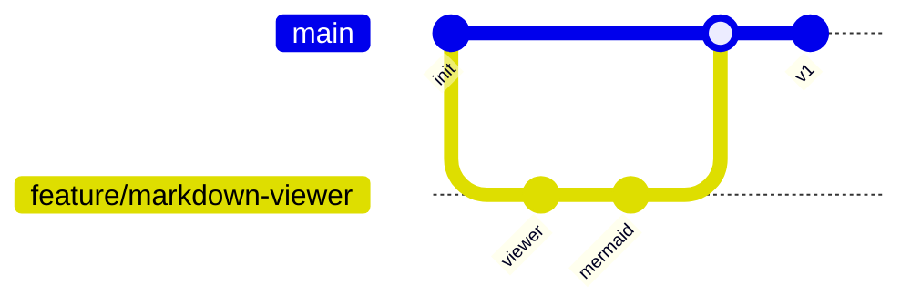
```mermaid
gitGraph
    commit id: "init"
    branch feature/markdown-viewer
    checkout feature/markdown-viewer
    commit id: "viewer"
    commit id: "mermaid"
    checkout main
    merge feature/markdown-viewer
    commit id: "v1"
```

---

# C4 Diagram Family

Mermaid currently exposes five C4 chart forms. C4 support is experimental in Mermaid, so these examples are part of the pinned-version regression fixture.

## 19. C4 System Context

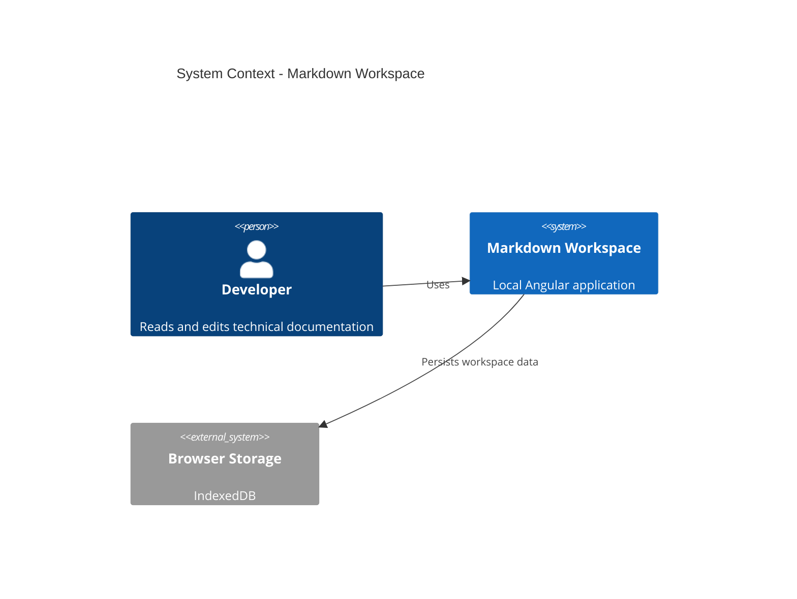
```mermaid
C4Context
    title System Context - Markdown Workspace
    Person(user, "Developer", "Reads and edits technical documentation")
    System(workspace, "Markdown Workspace", "Local Angular application")
    System_Ext(browserStorage, "Browser Storage", "IndexedDB")

    Rel(user, workspace, "Uses")
    Rel(workspace, browserStorage, "Persists workspace data")
```

## 20. C4 Container

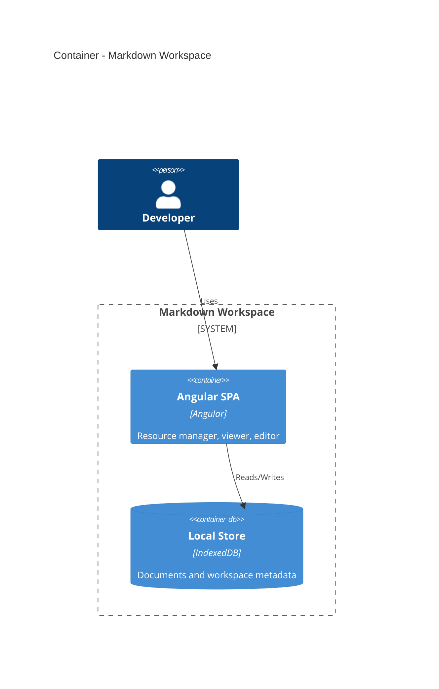
```mermaid
C4Container
    title Container - Markdown Workspace
    Person(user, "Developer")
    System_Boundary(app, "Markdown Workspace") {
        Container(ui, "Angular SPA", "Angular", "Resource manager, viewer, editor")
        ContainerDb(localdb, "Local Store", "IndexedDB", "Documents and workspace metadata")
    }
    Rel(user, ui, "Uses")
    Rel(ui, localdb, "Reads/Writes")
```

## 21. C4 Component

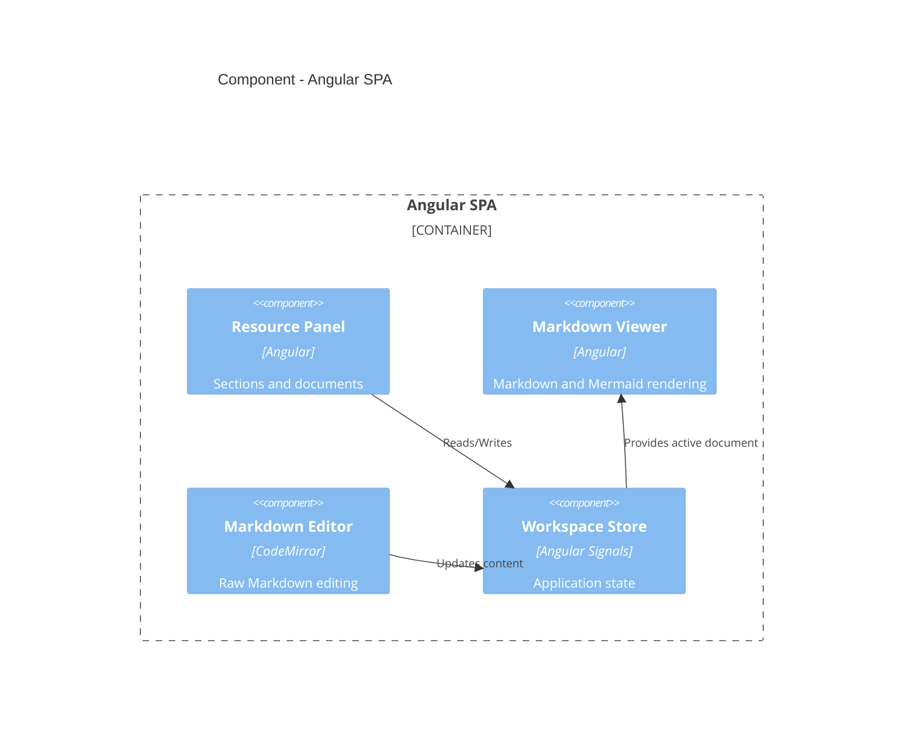
```mermaid
C4Component
    title Component - Angular SPA
    Container_Boundary(spa, "Angular SPA") {
        Component(resources, "Resource Panel", "Angular", "Sections and documents")
        Component(viewer, "Markdown Viewer", "Angular", "Markdown and Mermaid rendering")
        Component(editor, "Markdown Editor", "CodeMirror", "Raw Markdown editing")
        Component(store, "Workspace Store", "Angular Signals", "Application state")
    }
    Rel(resources, store, "Reads/Writes")
    Rel(editor, store, "Updates content")
    Rel(store, viewer, "Provides active document")
```

## 22. C4 Dynamic

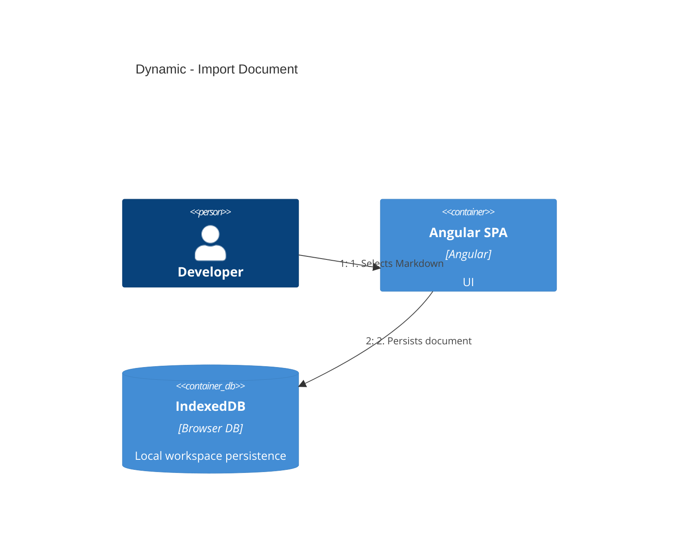
```mermaid
C4Dynamic
    title Dynamic - Import Document
    Person(user, "Developer")
    Container(ui, "Angular SPA", "Angular", "UI")
    ContainerDb(localdb, "IndexedDB", "Browser DB", "Local workspace persistence")

    Rel(user, ui, "1. Selects Markdown")
    Rel(ui, localdb, "2. Persists document")
```

## 23. C4 Deployment

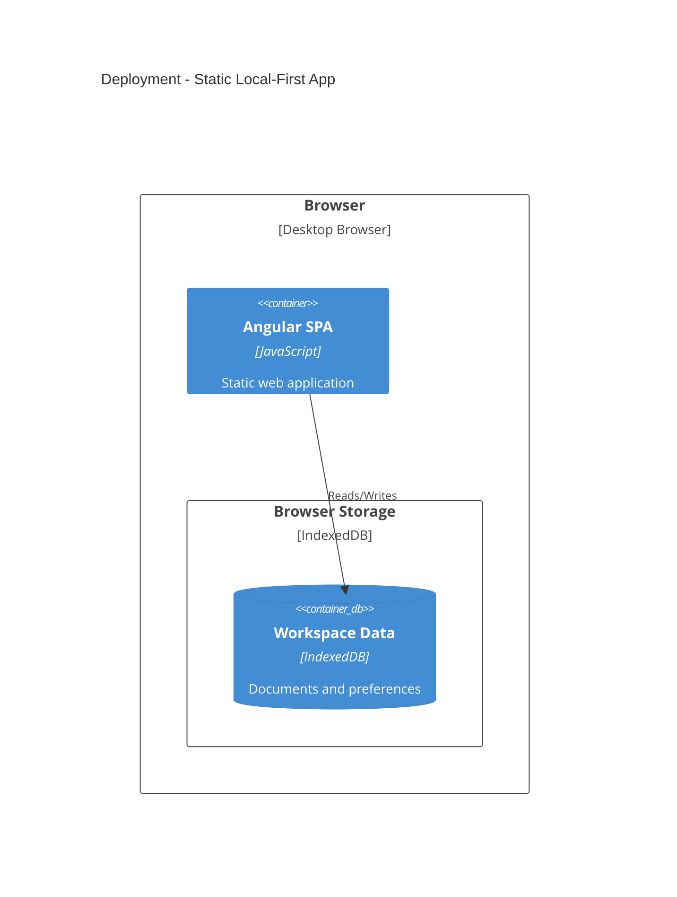
```mermaid
C4Deployment
    title Deployment - Static Local-First App
    Deployment_Node(browser, "Browser", "Desktop Browser") {
        Container(spa, "Angular SPA", "JavaScript", "Static web application")
        Deployment_Node(storage, "Browser Storage", "IndexedDB") {
            ContainerDb(localdb, "Workspace Data", "IndexedDB", "Documents and preferences")
        }
    }
    Rel(spa, localdb, "Reads/Writes")
```

---

## 24. Mindmap

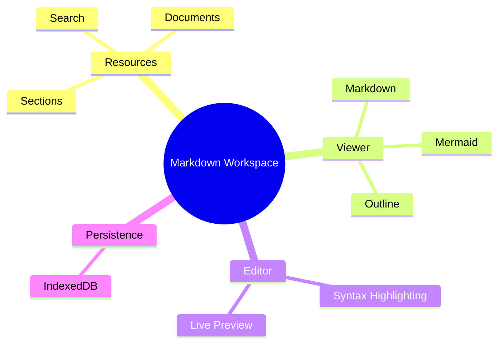
```mermaid
mindmap
  root((Markdown Workspace))
    Resources
      Sections
      Documents
      Search
    Viewer
      Markdown
      Mermaid
      Outline
    Editor
      Syntax Highlighting
      Live Preview
    Persistence
      IndexedDB
```

---

## 25. Timeline

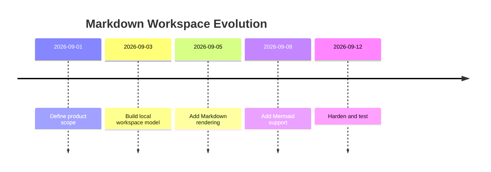
```mermaid
timeline
    title Markdown Workspace Evolution
    2026-09-01 : Define product scope
    2026-09-03 : Build local workspace model
    2026-09-05 : Add Markdown rendering
    2026-09-08 : Add Mermaid support
    2026-09-12 : Harden and test
```

---

## 26. ZenUML

```mermaid
zenuml
    title Import Markdown Flow
    @Actor User
    User->UI: chooseFile()
    UI->Store: importDocument()
    Store->IndexedDB: persist()
    IndexedDB-->Store: saved
    Store-->UI: documentReady
```

---

## 27. Sankey

```mermaid
sankey
Imported Files,Unassigned,4
Imported Files,Project A,7
Imported Files,Project B,5
Unassigned,Edited Documents,3
Project A,Edited Documents,6
Project B,Edited Documents,4
Edited Documents,Exported Files,10
```

---

## 28. XY Chart

```mermaid
xychart-beta
    title "Document Count by Week"
    x-axis [W1, W2, W3, W4, W5]
    y-axis "Documents" 0 --> 20
    bar [4, 7, 10, 14, 18]
    line [3, 6, 9, 13, 17]
```

---

## 29. Block Diagram

```mermaid
block-beta
    columns 3
    resources["Resources"] viewer["Markdown Viewer"] editor["Markdown Editor"]
    space store["Workspace Store"] space
    space db[("IndexedDB")] space

    resources --> store
    editor --> store
    store --> viewer
    store --> db
```

---

## 30. Packet Diagram

```mermaid
packet
    0-3: "Version"
    4-7: "Header Len"
    8-15: "Type"
    16-31: "Payload Length"
    32-63: "Payload"
```

---

## 31. Kanban

```mermaid
kanban
    todo[Todo]
        t1[Implement viewer]
        t2[Implement search]
    doing[In Progress]
        t3[Integrate Mermaid]
    done[Done]
        t4[Create PRD]
```

---

## 32. Architecture Diagram

```mermaid
architecture-beta
    group app(cloud)[Markdown Workspace]

    service resources(server)[Resource Panel] in app
    service viewer(server)[Markdown Viewer] in app
    service editor(server)[Markdown Editor] in app
    service db(database)[IndexedDB] in app

    resources:R --> L:viewer
    editor:L --> R:viewer
    viewer:B --> T:db
```

---

## 33. Radar Diagram

```mermaid
radar-beta
    title Markdown Workspace Quality Profile
    axis usability["Usability"], performance["Performance"], security["Security"], rendering["Rendering"], portability["Portability"]
    curve target{9,8,9,9,10}
    curve baseline{7,7,8,7,9}
    max 10
    min 0
```

---

## 34. Event Modeling

```mermaid
eventmodeling
    title Markdown Import
    tf 01 ui ImportDialog
    tf 02 cmd ImportDocument
    tf 03 evt DocumentImported
    tf 04 rmo WorkspaceResources
```

---

## 35. Treemap

```mermaid
treemap-beta
    "Workspace"
        "Project A"
            "PRD.md": 35
            "Architecture.md": 20
        "Project B"
            "Implementation.md": 30
            "Notes.md": 15
```

---

## 36. Venn

```mermaid
venn-beta
    title "Technical Documentation Overlap"
    set Product["Product"]:20
    set Engineering["Engineering"]:20
    set Operations["Operations"]:16
    union Product,Engineering["Technical PRD"]:6
    union Engineering,Operations["Runbook"]:5
    union Product,Engineering,Operations["System Knowledge"]:2
```

---

## 37. Ishikawa

```mermaid
ishikawa-beta
    Markdown Rendering Failure
    Parser
        Invalid syntax
        Unsupported extension
    Mermaid
        Diagram syntax error
        Version mismatch
    Storage
        Quota exceeded
        Corrupted state
    UI
        Oversized diagram
        Layout overflow
```

---

## 38. Wardley Map

```mermaid
wardley-beta
    title Markdown Workspace Strategy
    size [900, 500]

    anchor Developer [0.90, 0.95]
    component Viewer [0.78, 0.72]
    component Editor [0.67, 0.65]
    component Mermaid Renderer [0.58, 0.55]
    component IndexedDB [0.35, 0.88]

    Developer -> Viewer
    Viewer -> Mermaid Renderer
    Editor -> Viewer
    Viewer -> IndexedDB
```

---

## 39. Cynefin Framework

```mermaid
cynefin-beta
    title Engineering Decision Classification

    complex
        "Large architecture redesign"
        "Ambiguous cross-module behavior"

    complicated
        "Mermaid integration"
        "IndexedDB migration"

    clear
        "Rename document"
        "Toggle theme"

    chaotic
        "Corrupted workspace after crash"

    confusion
        "Unknown production issue"

    complex --> complicated : "Pattern understood"
    complicated --> clear : "Practice standardized"
```

---

## 40. TreeView

```mermaid
treeView-beta
    markdown-workspace/
        src/
            app/
                core/
                features/
                    markdown-viewer/
                    markdown-editor/
                    resources/
        PRD.md
        markdown-viewer-example.md
        package.json
```

---

# Additional Viewer Stress Examples

## 41. Long Paragraph

A technical Markdown viewer should remain comfortable to read even when a paragraph becomes relatively long. The central viewer should maintain a sensible maximum content width or typography strategy so that extremely wide desktop layouts do not turn paragraphs into visually exhausting single-line spans. The surrounding panels may be resized, but document readability should remain the primary design concern.

## 42. Nested Table-Like Technical Content

| Layer | Responsibility | Example |
|---|---|---|
| UI | Interaction | Resource panel, viewer, editor |
| State | Workspace semantics | Active document, sections, ordering |
| Persistence | Local durability | IndexedDB |
| Rendering | Markdown and Mermaid | Sanitized HTML + SVG |
| Export | User-controlled output | `.md` and ZIP |

---

# Optional Error-Isolation Fixture

The following block is intentionally invalid. A correct application should display a Mermaid error only for this block while continuing to render the rest of the document.

```mermaid
flowchart LR
    A[Valid start] -->
```

If this sentence is visible after the invalid block, document-level error isolation is functioning.

---

# End of Fixture

Expected high-level result:

- Markdown syntax renders correctly.
- Tables are readable.
- Code blocks are highlighted where supported.
- Every valid Mermaid block is rendered using the pinned Mermaid baseline.
- Large diagrams remain navigable.
- The intentionally invalid Mermaid block fails locally rather than crashing the document.
