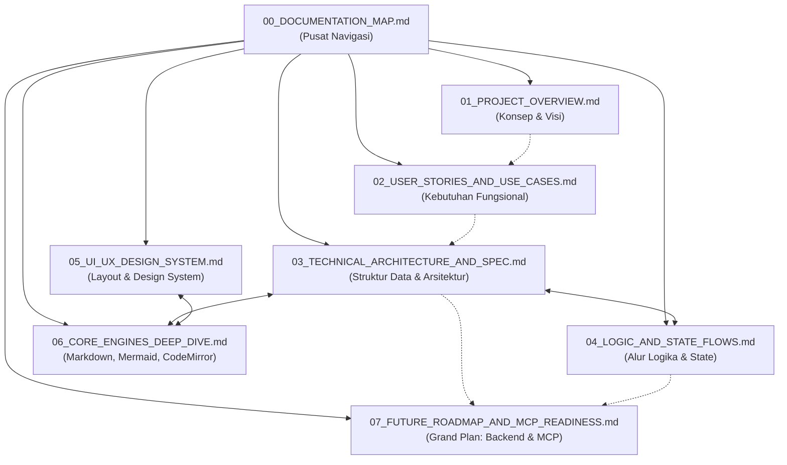

# Document Mapping & Navigation Index
**Project:** Nobody Markdown Viewer (v1.0.5+)  
**Repository:** `ai-research/markdown-viewer`  
**Purpose:** Peta navigasi dokumentasi komprehensif yang memetakan seluruh aspek teknis, UI/UX, logic, dan arsitektur aplikasi sebagai landasan pengembangan lanjutan menuju platform data-driven dan integrasi MCP.

---

## 1. Peta Dokumen (Documentation Matrix)

Dokumentasi ini dikelompokkan ke dalam 7 modul spesifikasi teknis dan analitis:

| No | Dokumen | Fokus Utama | Target Pembaca | Kategori |
|:---:|---|---|---|---|
| **00** | [00_DOCUMENTATION_MAP.md](file:///Users/mypro/gengs/ai-research/markdown-viewer/docs/00_DOCUMENTATION_MAP.md) | Indeks, relasi antar dokumen, dan panduan membaca | Semua Stakeholder | Meta / Index |
| **01** | [01_PROJECT_OVERVIEW.md](file:///Users/mypro/gengs/ai-research/markdown-viewer/docs/01_PROJECT_OVERVIEW.md) | Deskripsi proyek, visi, masalah yang dipecahkan, state terkini | PM, Tech Lead, Dev | Overview & Vision |
| **02** | [02_USER_STORIES_AND_USE_CASES.md](file:///Users/mypro/gengs/ai-research/markdown-viewer/docs/02_USER_STORIES_AND_USE_CASES.md) | Persona pengguna, Epics, User Stories, kriteria penerimaan | Product, QA, Frontend | Functional Requirements |
| **03** | [03_TECHNICAL_ARCHITECTURE_AND_SPEC.md](file:///Users/mypro/gengs/ai-research/markdown-viewer/docs/03_TECHNICAL_ARCHITECTURE_AND_SPEC.md) | Arsitektur teknis, data model, storage, sanitasi, build system | System Architect, Backend/Frontend Dev | Technical Specification |
| **04** | [04_LOGIC_AND_STATE_FLOWS.md](file:///Users/mypro/gengs/ai-research/markdown-viewer/docs/04_LOGIC_AND_STATE_FLOWS.md) | State management Signals, autosave pipeline, lifecycle, event bus | Frontend Dev, Engine Engineer | Logic & State Flow |
| **05** | [05_UI_UX_DESIGN_SYSTEM.md](file:///Users/mypro/gengs/ai-research/markdown-viewer/docs/05_UI_UX_DESIGN_SYSTEM.md) | 3-Panel layout, splitters, design tokens, light/dark themes, kontras | UI/UX Designer, Frontend Dev | UI/UX & Styling |
| **06** | [06_CORE_ENGINES_DEEP_DIVE.md](file:///Users/mypro/gengs/ai-research/markdown-viewer/docs/06_CORE_ENGINES_DEEP_DIVE.md) | Bedah teknis: Markdown parser, Mermaid 11.17.2, CodeMirror 6 | Engine Specialist, Senior Dev | Core Engines |
| **07** | [07_FUTURE_ROADMAP_AND_MCP_READINESS.md](file:///Users/mypro/gengs/ai-research/markdown-viewer/docs/07_FUTURE_ROADMAP_AND_MCP_READINESS.md) | Rencana transisi ke backend, sharing content, dan integrasi MCP | Architect, AI Engineer, Backend Dev | Future Architecture |

---

## 2. Diagram Relasi Antar Dokumen

---

## 3. Matriks Pemetaan File Source Code ke Dokumen Teknis

Berikut adalah pelacakan langsung antara file kode dalam repositori ke dokumen analisis yang bersangkutan:

| Path File Source Code | Komponen / Service | Dokumen Pembahasan Utama |
|---|---|---|
| [`src/app/core/models/workspace.models.ts`](file:///Users/mypro/gengs/ai-research/markdown-viewer/src/app/core/models/workspace.models.ts) | Model entitas: Section, MarkdownDocument, Preferences | `03_TECHNICAL_ARCHITECTURE_AND_SPEC.md` |
| [`src/app/core/services/workspace.store.ts`](file:///Users/mypro/gengs/ai-research/markdown-viewer/src/app/core/services/workspace.store.ts) | State Store Reaktif (Signals), CRUD, Outline, Autosave | `03_TECHNICAL_ARCHITECTURE_AND_SPEC.md`, `04_LOGIC_AND_STATE_FLOWS.md` |
| [`src/app/core/storage/indexeddb.service.ts`](file:///Users/mypro/gengs/ai-research/markdown-viewer/src/app/core/storage/indexeddb.service.ts) | Local Persistence DB (`markdown_workspace_db`) | `03_TECHNICAL_ARCHITECTURE_AND_SPEC.md`, `04_LOGIC_AND_STATE_FLOWS.md` |
| [`src/app/core/storage/preferences.service.ts`](file:///Users/mypro/gengs/ai-research/markdown-viewer/src/app/core/storage/preferences.service.ts) | LocalStorage Handler (Theme, Panel Widths, Layout Mode) | `03_TECHNICAL_ARCHITECTURE_AND_SPEC.md`, `05_UI_UX_DESIGN_SYSTEM.md` |
| [`src/app/core/security/sanitizer.service.ts`](file:///Users/mypro/gengs/ai-research/markdown-viewer/src/app/core/security/sanitizer.service.ts) | DOMPurify Security Wrapper & XSS Protection | `03_TECHNICAL_ARCHITECTURE_AND_SPEC.md`, `06_CORE_ENGINES_DEEP_DIVE.md` |
| [`src/app/core/utils/clipboard.util.ts`](file:///Users/mypro/gengs/ai-research/markdown-viewer/src/app/core/utils/clipboard.util.ts) | Clipboard API & Fallback execCommand | `03_TECHNICAL_ARCHITECTURE_AND_SPEC.md`, `06_CORE_ENGINES_DEEP_DIVE.md` |
| [`src/app/core/services/export.service.ts`](file:///Users/mypro/gengs/ai-research/markdown-viewer/src/app/core/services/export.service.ts) | Single `.md` & JSZip Workspace Bundler | `02_USER_STORIES_AND_USE_CASES.md`, `03_TECHNICAL_ARCHITECTURE_AND_SPEC.md` |
| [`src/app/core/services/keyboard-shortcuts.service.ts`](file:///Users/mypro/gengs/ai-research/markdown-viewer/src/app/core/services/keyboard-shortcuts.service.ts) | Global Keyboard Event Listener (`⌘P`, `⌘S`, `⌘O`, `⌘E`) | `04_LOGIC_AND_STATE_FLOWS.md` |
| [`src/app/features/shell/main-layout.component.ts`](file:///Users/mypro/gengs/ai-research/markdown-viewer/src/app/features/shell/main-layout.component.ts) | 3-Panel Layout & Drag Splitters Engine | `05_UI_UX_DESIGN_SYSTEM.md` |
| [`src/app/features/shell/header.component.ts`](file:///Users/mypro/gengs/ai-research/markdown-viewer/src/app/features/shell/header.component.ts) | Header Toolbar, Brand, Layout Toggles, Status Pill | `05_UI_UX_DESIGN_SYSTEM.md` |
| [`src/app/features/markdown-viewer/markdown-viewer.component.ts`](file:///Users/mypro/gengs/ai-research/markdown-viewer/src/app/features/markdown-viewer/markdown-viewer.component.ts) | GFM Parser Chunking, Code Block Copy, TOC Scrolling | `06_CORE_ENGINES_DEEP_DIVE.md` |
| [`src/app/features/markdown-viewer/mermaid-renderer.component.ts`](file:///Users/mypro/gengs/ai-research/markdown-viewer/src/app/features/markdown-viewer/mermaid-renderer.component.ts) | Mermaid 11.17.2 Pipeline, Zoom, Pan, Error Boundary | `06_CORE_ENGINES_DEEP_DIVE.md` |
| [`src/app/features/markdown-editor/markdown-editor.component.ts`](file:///Users/mypro/gengs/ai-research/markdown-viewer/src/app/features/markdown-editor/markdown-editor.component.ts) | CodeMirror 6 Setup, Compartment, Live Sync | `06_CORE_ENGINES_DEEP_DIVE.md` |
| [`src/app/features/resources/resource-panel.component.ts`](file:///Users/mypro/gengs/ai-research/markdown-viewer/src/app/features/resources/resource-panel.component.ts) | Explorer Tab Container (Files vs Outline), Filter Input | `05_UI_UX_DESIGN_SYSTEM.md` |
| [`src/app/features/resources/section-list.component.ts`](file:///Users/mypro/gengs/ai-research/markdown-viewer/src/app/features/resources/section-list.component.ts) | Accordion Section List & Document Drag/Drop Reorder | `04_LOGIC_AND_STATE_FLOWS.md`, `05_UI_UX_DESIGN_SYSTEM.md` |
| [`src/app/features/resources/outline-tree.component.ts`](file:///Users/mypro/gengs/ai-research/markdown-viewer/src/app/features/resources/outline-tree.component.ts) | H1-H6 Table of Contents Tree Component | `04_LOGIC_AND_STATE_FLOWS.md`, `05_UI_UX_DESIGN_SYSTEM.md` |
| [`src/app/features/search/search-dialog.component.ts`](file:///Users/mypro/gengs/ai-research/markdown-viewer/src/app/features/search/search-dialog.component.ts) | Full-Text Search Palette (`⌘P`) with Snippet Generator | `02_USER_STORIES_AND_USE_CASES.md`, `04_LOGIC_AND_STATE_FLOWS.md` |
| [`src/app/features/import/import-dialog.component.ts`](file:///Users/mypro/gengs/ai-research/markdown-viewer/src/app/features/import/import-dialog.component.ts) | Multi-File Dropzone & Target Section Picker | `02_USER_STORIES_AND_USE_CASES.md` |
| [`src/styles.scss`](file:///Users/mypro/gengs/ai-research/markdown-viewer/src/styles.scss) | Global CSS Design Tokens, Light/Dark Overhaul, Reset | `05_UI_UX_DESIGN_SYSTEM.md` |
| [`wrangler.jsonc`](file:///Users/mypro/gengs/ai-research/markdown-viewer/wrangler.jsonc) | Cloudflare Workers Static Assets & SPA Routing Config | `01_PROJECT_OVERVIEW.md`, `03_TECHNICAL_ARCHITECTURE_AND_SPEC.md` |

---

## 4. Panduan Membaca Berdasarkan Kebutuhan

- **Untuk Memahami Fungsionalitas Aplikasi Saat Ini:**
  Mulai dari `01_PROJECT_OVERVIEW.md` lalu lanjutkan ke `02_USER_STORIES_AND_USE_CASES.md`.
- **Untuk Memahami Alur Kode & State Management:**
  Baca `03_TECHNICAL_ARCHITECTURE_AND_SPEC.md` diikuti `04_LOGIC_AND_STATE_FLOWS.md`.
- **Untuk Memahami Desain, Tema, & Layout 3 Panel:**
  Fokus pada `05_UI_UX_DESIGN_SYSTEM.md`.
- **Untuk Mengoptimalkan Engine Markdown, Mermaid, atau CodeMirror:**
  Pelajari secara detail di `06_CORE_ENGINES_DEEP_DIVE.md`.
- **Untuk Merancang Backend, Database Cloud, Sharing, & Model Context Protocol (MCP):**
  Langsung menuju `07_FUTURE_ROADMAP_AND_MCP_READINESS.md`.
