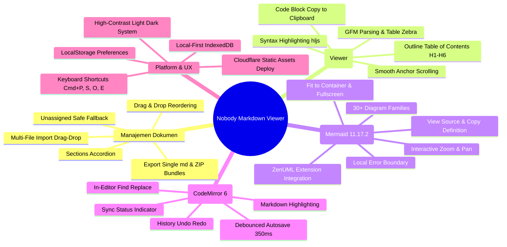

# 01. Project Overview & Product Vision
**Project Name:** Nobody Markdown Viewer  
**Current Version:** `1.0.5` (Latest)  
**Architecture Paradigm:** Local-First Single Page Application (SPA)  
**Core Stack:** Angular 20 (Signals, Standalone Components), CodeMirror 6, Mermaid 11.17.2, Marked, Highlight.js, IndexedDB, DOMPurify  
**Edge Hosting:** Cloudflare Workers Static Assets (`markdown.nobodygengs.workers.dev`) / Cloudflare Pages

---

## 1. Executive Summary

**Nobody Markdown Viewer** adalah platform workspace dokumentasi teknis berbasis web yang berfokus pada pengalaman membaca, mengedit, mengorganisasi, dan memvisualisasikan dokumen Markdown beserta diagram teknis (Mermaid) secara instan, aman, dan tanpa ketergantungan pada backend eksternal (*zero-backend / local-first*).

Aplikasi ini dirancang untuk menjawab kelemahan umum markdown viewer konvensional yang kaku, lambat saat memuat dokumen besar dengan banyak diagram, tidak memiliki isolasi kegagalan diagram (*error containment*), serta mengharuskan pengguna mengunggah dokumen sensitif ke server pihak ketiga. Dengan memanfaatkan IndexedDB browser, seluruh berkas, section, preferensi layout, dan autosave disimpan secara lokal di mesin pengguna dengan performa setara aplikasi native.

---

## 2. Masalah yang Dipecahkan (Problems & Solutions)

| No | Masalah Tradisional | Solusi pada Nobody Markdown Viewer |
|:---:|---|---|
| **1** | **Diagram Error Merusak Seluruh Halaman**: Pada renderer standar, satu syntax error pada Mermaid akan melempar unhandled exception yang merusak render markdown di sekitarnya. | **Robust Error Boundary & Isolation**: Setiap diagram diparsing sebagai chunk terisolasi. Jika diagram error, sistem menangkap error lokal, merender kartu peringatan interaktif dengan tombol *[View Raw Source]*, tanpa mempengaruhi blok lain. |
| **2** | **Ketergantungan Cloud & Isu Privasi Data**: Banyak viewer online mengharuskan pengiriman teks ke server backend, berisiko membocorkan dokumen teknis rahasia. | **100% Local-First via IndexedDB**: Data tidak pernah meninggalkan browser. Dokumen dan section disimpan dalam IndexedDB lokal (`markdown_workspace_db`) dengan persistensi permanen. |
| **3** | **Layout yang Kaku**: Pengguna seringkali harus memilih antara hanya membaca (viewer) atau hanya mengetik (editor). | **Viewer-Dominant Flexible 3-Panel Layout**: 3 panel yang dapat di-drag dividernya secara bebas (Resources, Viewer, Editor) dengan 5 preset layout yang dapat diakses instan. |
| **4** | **Kontras & Tema yang Tidak Konsisten**: Diagram SVG sering kali menjadi gelap atau hitam saat berganti tema gelap/terang. | **High-Contrast Theming Engine**: Sinkronisasi variabel tema global dengan SVG post-processing dan Mermaid theme variables otomatis pada mode Light, Dark, maupun System. |
| **5** | **Manajemen Multi-Dokumen yang Lambat**: Sulit berpindah-pindah antar dokumen teknis tanpa struktur folder yang rapi. | **Section Accordion & Instant Search (`⌘P`)**: Dokumen dikelompokkan ke dalam Section yang dapat di-reorder, ditambah fitur quick search modal dengan cuplikan teks langsung. |

---

## 3. Fitur Utama Versi Saat Ini (Current Capabilities)



---

## 4. Struktur Direktori Proyek

```text
markdown-viewer/
├── .plan/                               # Dokumen spesifikasi awal & fixture contoh
│   ├── PRD.md                           # Product Requirements Document komprehensif
│   └── markdown-viewer-example.md       # Fixture teknis dengan 40+ diagram Mermaid
├── docs/                                # Dokumentasi teknis & arsitektur terkini
│   ├── 00_DOCUMENTATION_MAP.md          # Peta navigasi dokumentasi
│   ├── 01_PROJECT_OVERVIEW.md           # Deskripsi proyek & visi (dokumen ini)
│   ├── 02_USER_STORIES_AND_USE_CASES.md # Kebutuhan fungsional & user stories
│   ├── 03_TECHNICAL_ARCHITECTURE_AND_SPEC.md # Arsitektur & spesifikasi teknis
│   ├── 04_LOGIC_AND_STATE_FLOWS.md      # State management & alur logika
│   ├── 05_UI_UX_DESIGN_SYSTEM.md        # Layout 3 panel & sistem desain
│   ├── 06_CORE_ENGINES_DEEP_DIVE.md     # Parser, Mermaid, & CodeMirror
│   └── 07_FUTURE_ROADMAP_AND_MCP_READINESS.md # Blueprint backend & MCP
├── public/                              # Aset publik statis
│   ├── favicon.ico                      # Ikon aplikasi
│   └── fixtures/                        # Fixture cadangan pemuatan offline
├── src/
│   ├── index.html                       # Entry HTML dengan title 'Nobody Markdown Viewer'
│   ├── main.ts                          # Bootstrap aplikasi Angular Standalone
│   ├── styles.scss                      # Global design system tokens & theme overrides
│   └── app/
│       ├── app.config.ts                # Konfigurasi Angular application
│       ├── app.html / app.scss / app.ts # Root shell component & global listener
│       ├── core/                        # Core layer independen
│       │   ├── models/                  # Interface TypeScript (Document, Section, Prefs)
│       │   ├── security/                # Sanitizer service (DOMPurify XSS protection)
│       │   ├── services/                # Workspace store, shortcuts, export service
│       │   ├── storage/                 # IndexedDB & LocalStorage preferences
│       │   └── utils/                   # Clipboard utility dengan fallback
│       └── features/                    # UI Feature modules (Standalone Components)
│           ├── import/                  # Dialog impor berkas multi-file
│           ├── markdown-editor/         # Editor CodeMirror 6 dengan status pill
│           ├── markdown-viewer/         # GFM renderer & Mermaid isolated renderer
│           ├── resources/               # Explorer panel, section accordion, outline tree
│           ├── search/                  # Full-text search palette modal (`⌘P`)
│           └── shell/                   # Main layout resizable & top header bar
├── angular.json                         # Konfigurasi Angular CLI / esbuild builder
├── package.json                         # Dependensi & NPM scripts
├── tsconfig.json                        # Konfigurasi TypeScript strict mode
└── wrangler.jsonc                       # Konfigurasi Cloudflare Workers Static Assets
```

---

## 5. Pondasi Menuju Grand Plan (Backend, Sharing, & MCP)

Versi saat ini (`v1.0.5`) sengaja dibangun dengan batas abstraksi yang sangat bersih (*clean separation of concerns*):
1. **Pemisahan UI dan Store**: Seluruh state aplikasi diisolasi di [`workspace.store.ts`](file:///Users/mypro/gengs/ai-research/markdown-viewer/src/app/core/services/workspace.store.ts). Komponen UI hanya bertindak sebagai *consumer* dan *dispatcher*, sehingga di masa depan penggantian sumber data dari IndexedDB ke API backend (REST/GraphQL/WebSocket) tidak akan merombak UI layer.
2. **Model Data yang Normal & Fleksibel**: Entitas `Section` dan `MarkdownDocument` menggunakan ID string unik, timestamp ISO, dan metadata kepemilikan yang siap dipetakan langsung ke schema database relasional (PostgreSQL) atau dokumen (MongoDB).
3. **Kesiapan Model Context Protocol (MCP)**: Struktur chunking dokumen yang memisahkan konten naratif dan blok diagram teknis memudahkan agen AI/LLM untuk membaca konteks parsial, memvalidasi diagram, mengekstrak outline, atau menyuntikkan dokumen baru melalui MCP Server di masa depan.
