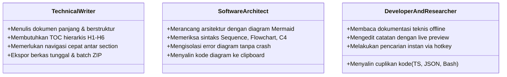

# 02. User Stories & Use Cases
**Project:** Nobody Markdown Viewer (v1.0.5+)  
**Category:** Functional Requirements & User Experience Specification

---

## 1. Persona Pengguna (User Personas)



---

## 2. Rincian Epics & User Stories

### Epic 1: Pengorganisasian & Siklus Hidup Dokumen (Document Lifecycle)

#### US-1.1: Pembuatan dan Penamaan Section
- **Sebagai** pengguna,  
  **Saya ingin** membuat section baru untuk mengelompokkan dokumen teknis,  
  **Agar** workspace saya tetap teratur berdasarkan modul atau proyek.
- **Kriteria Penerimaan (Acceptance Criteria):**
  - *Given* pengguna berada di tab *Files* pada panel Explorer.
  - *When* pengguna mengklik tombol *New Section* dan memasukkan nama section.
  - *Then* section baru dibuat dengan status uncollapsed, tersimpan di IndexedDB, dan urutan diletakkan di posisi paling bawah.
- **Kasus Ujung (Edge Cases):**
  - Jika nama section kosong/spasi saja, sistem memberikan fallback otomatis `'New Section'`.
  - Section bawaan `Unassigned` tidak dapat diubah namanya maupun dihapus (`isSystem: true`).

#### US-1.2: Penghapusan Section & Strategi Migrasi Dokumen
- **Sebagai** pengguna,  
  **Saya ingin** menghapus section yang sudah tidak relevan,  
  **Dengan opsi** memindahkan dokumen ke `Unassigned` atau menghapus seluruh dokumen di dalamnya.
- **Kriteria Penerimaan:**
  - *Given* section berisi 3 dokumen.
  - *When* pengguna memilih opsi hapus section dengan strategi `'move-to-unassigned'`.
  - *Then* section dihapus dari DB, dan ketiga dokumen dipindahkan secara otomatis ke section `Unassigned` tanpa kehilangan data konten.

---

### Epic 2: Multi-File Ingestion & Drag-Drop Import

#### US-2.1: Impor Berkas Markdown Sekaligus (Batch Import)
- **Sebagai** pengguna,  
  **Saya ingin** mengimpor beberapa berkas `.md` sekaligus melalui drag-and-drop atau file picker,  
  **Agar** saya dapat langsung membaca koleksi dokumen lokal saya.
- **Kriteria Penerimaan:**
  - *Given* pengguna membuka dialog import (`⌘O` atau tombol import).
  - *When* pengguna memilih target section dan men-drop 5 berkas (4 file `.md` dan 1 file `.exe`).
  - *Then* 4 berkas `.md` berhasil diimpor ke target section, 1 berkas non-markdown dilewati, dan dialog menampilkan ringkasan *"Successfully imported 4 document(s). (1 skipped)"*.
  - Dokumen pertama yang baru diimpor otomatis menjadi dokumen aktif.
- **Kasus Ujung:**
  - Jika ada nama berkas duplikat di section yang sama, sistem otomatis menambahkan penomoran unik (misal: `architecture (1).md`).

---

### Epic 3: Pengalaman Membaca Teknis & Salin Kode (Viewer & Clipboard)

#### US-3.1: Syntax Highlighting & Copy to Clipboard pada Blok Kode
- **Sebagai** developer yang membaca dokumentasi,  
  **Saya ingin** menyalin kode sumber (TypeScript, JSON, Bash, dsb.) dengan 1-klik,  
  **Agar** saya dapat menggunakannya di terminal atau IDE tanpa perlu menyeleksi teks secara manual.
- **Kriteria Penerimaan:**
  - *Given* viewer menampilkan blok kode dengan bahasa tertentu (contoh: TypeScript).
  - *When* pengguna mengklik tombol *"Copy"* di header blok kode.
  - *Then* kode sumber asli disalin secara presisi ke clipboard pengguna (mempertahankan karakter spasi dan baris baru).
  - Label tombol berubah menjadi *"Copied!"* dengan ikon centang hijau selama 2 detik sebelum kembali ke semula.

#### US-3.2: Navigasi Table of Contents (Outline)
- **Sebagai** pembaca dokumen panjang,  
  **Saya ingin** melihat struktur judul dokumen (H1–H6) di tab Outline dan mengkliknya,  
  **Agar** viewer otomatis melakukan smooth scroll ke bagian yang relevan.
- **Kriteria Penerimaan:**
  - *Given* dokumen aktif memiliki beberapa heading `## 1. Arsitektur`.
  - *When* pengguna mengklik item tersebut di panel Outline.
  - *Then* viewer container melakukan *smooth scroll* ke elemen target dengan ID slug yang bersangkutan.

---

### Epic 4: Diagram Teknis Mermaid & Isolasi Kegagalan (Mermaid Engine)

#### US-4.1: Interaksi Diagram (Zoom, Pan, Fullscreen)
- **Sebagai** arsitek sistem,  
  **Saya ingin** memperbesar (zoom), menggeser (pan), dan membuka diagram berukuran besar dalam mode layar penuh (fullscreen),  
  **Agar** saya dapat memeriksa detail arsitektur yang kompleks dengan nyaman.
- **Kriteria Penerimaan:**
  - Diagram dilengkapi toolbar dengan tombol:
    - Zoom In (`+15%` per klik, batas maksimal `350%`).
    - Zoom Out (`-15%` per klik, batas minimal `30%`).
    - Reset Zoom (`100%`).
    - Fit to Container (menyesuaikan skala dengan lebar kontainer).
    - Fullscreen Modal (membuka diagram di atas seluruh antarmuka).
  - Pengguna dapat melakukan pan dengan klik dan seret mouse (*drag-to-pan*) pada viewport diagram.

#### US-4.2: Isolasi Error Sintaks Diagram (Error Containment)
- **Sebagai** pengguna yang menulis draft diagram Mermaid yang belum valid,  
  **Saya ingin** sistem menampilkan kartu peringatan lokal tanpa mematahkan rendering markdown dokumen lainnya,  
  **Dan** menyediakan tombol untuk melihat kode sumber diagram yang bermasalah.
- **Kriteria Penerimaan:**
  - *Given* sebuah blok ```mermaid berisi sintaks tidak valid (misal: parse error).
  - *When* parser membaca blok tersebut.
  - *Then* hanya blok diagram tersebut yang menampilkan kartu error merah ramah pengguna (*"Mermaid diagram could not be rendered"*).
  - Teks naratif sebelum dan sesudah diagram tetap terender secara sempurna.
  - Pengguna dapat mengklik tombol *[View Raw Source]* untuk melihat dan menyalin kode yang keliru guna diperbaiki.

---

### Epic 5: Live In-Browser Editing & Autosave (CodeMirror 6)

#### US-5.1: Pengeditan Langsung dengan Debounced Autosave
- **Sebagai** penulis teknis,  
  **Saya ingin** mengedit teks markdown secara langsung di panel kanan dan melihat perubahannya tersimpan otomatis,  
  **Agar** pekerjaan saya tidak hilang tanpa perlu sering menekan tombol simpan manual.
- **Kriteria Penerimaan:**
  - Saat pengguna mengetik di editor:
    - Status pill menampilkan indikator oranye *"Editing..."*.
    - Perubahan teks dipancarkan ke `autosaveSubject` dengan jeda debounce 350ms.
    - Setelah 350ms tanpa ketikan baru, sistem menyimpan konten ke IndexedDB, status berubah menjadi hijau *"Saved locally"*, lalu kembali ke *"Synced"* (idle).
  - Pengguna dapat menekan hotkey `⌘S` (Mac) atau `Ctrl+S` (Windows/Linux) untuk memaksa penyimpanan instan (*force save*).

---

### Epic 6: Pencarian Cepat Global (Full-Text Search Modal `⌘P`)

#### US-6.1: Pencarian Lintas Dokumen dengan Cuplikan Teks
- **Sebagai** pengguna dengan banyak dokumen teknis di workspace,  
  **Saya ingin** menekan `⌘P` dan mengetik kata kunci pencarian,  
  **Agar** saya dapat menemukan berkas maupun teks spesifik di dalam isi dokumen dalam hitungan milidetik.
- **Kriteria Penerimaan:**
  - Menekan `⌘P` atau tombol search di header membuka modal search palette.
  - Pencarian memeriksa kecocokan pada nama berkas (*filename match*) dan isi seluruh dokumen (*content match*).
  - Hasil pencarian menampilkan nama dokumen, section pemilik, jumlah kecocokan (*match count*), serta cuplikan teks (*snippet*) dengan highlight.
  - Mendukung navigasi keyboard (`Arrow Down`, `Arrow Up`, `Enter` untuk membuka, dan `ESC` untuk menutup).

---

### Epic 7: Portabilitas & Ekspor (Single & ZIP Bundling)

#### US-7.1: Ekspor Berkas Tunggal dan Seluruh Workspace
- **Sebagai** pengguna,  
  **Saya ingin** mengekspor dokumen sebagai `.md` atau seluruh workspace sebagai arsip `.zip`,  
  **Agar** dokumentasi dapat saya bagikan ke rekan tim atau diarsipkan secara offline.
- **Kriteria Penerimaan:**
  - Tombol aksi pada dokumen memungkinkan pengunduhan file tunggal `nama-file.md`.
  - Tombol aksi pada header section memungkinkan pengunduhan ZIP berisi seluruh berkas dalam section tersebut.
  - Tombol *Export ZIP* pada header utama mengemas seluruh section dan dokumen ke dalam satu arsip `workspace-export.zip` dengan struktur folder yang rapi.
