# 03. Technical Architecture & Specification
**Project:** Nobody Markdown Viewer (v1.0.5+)  
**Category:** System Architecture & Technical Specifications

---

## 1. Arsitektur Berlapis (Layered Architecture)

Aplikasi dibangun dengan arsitektur bersih (*Clean Architecture*) berbasis komponen mandiri (*Standalone Components*) dan reaktivitas berbasis Angular Signals:

```mermaid
graph TD
    subgraph Presentation Layer [Presentation Layer: Features & Shell]
        Shell["Header & MainLayout<br/>(Panel Splitting & Controls)"]
        Explorer["ResourcePanel<br/>(SectionList & OutlineTree)"]
        Viewer["MarkdownViewer<br/>(GFM Parser, hljs, Copy)"]
        MermaidComp["MermaidRenderer<br/>(Zoom, Pan, Source, Error Boundary)"]
        Editor["MarkdownEditor<br/>(CodeMirror 6, Compartment)"]
        Modals["SearchDialog & ImportDialog"]
    end

    subgraph Core Layer [Core State & Domain Services]
        Store["WorkspaceStore (Signals)<br/>(Centralized State & Autosave Pipeline)"]
        Shortcuts["KeyboardShortcutsService<br/>(Global Hotkeys ⌘P, ⌘S, ⌘O, ⌘E)"]
        Exporter["ExportService<br/>(Single .md & JSZip Bundling)"]
        Sanitizer["SanitizerService<br/>(DOMPurify Hooks & Allowlist)"]
        ClipUtil["clipboard.util.ts<br/>(navigator.clipboard & Fallback)"]
    end

    subgraph Storage Layer [Persistence Layer: Browser Storage]
        IDB["IndexedDbService<br/>(markdown_workspace_db: sections, documents)"]
        Prefs["PreferencesService<br/>(localStorage: markdown_workspace_preferences)"]
    end

    subgraph External Engines [External Engines & Parsers]
        MParser["Marked Parser + Highlight.js"]
        MermaidLib["Mermaid 11.17.2 + @mermaid-js/mermaid-zenuml"]
        CM6["CodeMirror 6 (State, View, Markdown Lang)"]
    end

    Shell --> Store
    Explorer --> Store
    Viewer --> Store
    Viewer --> Sanitizer
    Viewer --> ClipUtil
    Viewer --> MParser
    Viewer --> MermaidComp
    MermaidComp --> MermaidLib
    MermaidComp --> ClipUtil
    Editor --> Store
    Editor --> CM6
    Modals --> Store
    Store --> IDB
    Store --> Prefs
    Store --> Exporter
```



---

## 2. Model Data & Spesifikasi Interface (Data Models)

Terdefinisi pada [`src/app/core/models/workspace.models.ts`](file:///Users/mypro/gengs/ai-research/markdown-viewer/src/app/core/models/workspace.models.ts):

### 2.1 Entitas Section
```typescript
export interface Section {
  id: string;          // Format: 'section-[timestamp]-[random4]' atau UNASSIGNED_SECTION_ID
  name: string;        // Nama tampilan section (misal: 'Arsitektur', 'Panduan API')
  order: number;       // Urutan tampilan dalam accordion (0-indexed)
  isSystem: boolean;   // true untuk section 'Unassigned' (tidak bisa dihapus/direname)
  collapsed: boolean;  // Status visual accordion (terbuka / terlipat)
  createdAt: string;   // ISO 8601 string
  updatedAt: string;   // ISO 8601 string
}
```

### 2.2 Entitas MarkdownDocument
```typescript
export interface MarkdownDocument {
  id: string;          // Format: 'doc-[timestamp]-[random4]'
  sectionId: string;   // Foreign key ke Section.id
  fileName: string;    // Nama berkas, wajib berekstensi '.md'
  title?: string;      // Judul opsional dokumen
  content: string;     // Konten mentah Markdown (raw string UTF-8)
  order: number;       // Urutan dokumen dalam section (0-indexed)
  sourceType: 'imported' | 'created'; // Sumber asal dokumen
  createdAt: string;   // ISO 8601 string
  updatedAt: string;   // ISO 8601 string
}
```

### 2.3 Preferensi Workspace & UI State
```typescript
export type ThemeMode = 'light' | 'dark' | 'system';
export type LayoutMode = 'default' | 'viewer-dominant' | 'viewer-only' | 'editor-only' | 'viewer-editor';
export type SaveStatus = 'idle' | 'editing' | 'saving' | 'saved' | 'error';

export interface WorkspacePreferences {
  theme: ThemeMode;
  resourcePanelWidth: number;   // Batas: min 200px, max 500px (default 280px)
  editorPanelWidth: number;     // Batas: min 240px, max 600px (default 360px)
  layoutMode: LayoutMode;       // Preset tampilan aktif
  activeDocumentId?: string;    // ID dokumen terakhir yang dibuka
  resourceActiveTab: 'files' | 'outline'; // Tab aktif pada panel kiri
}

export const UNASSIGNED_SECTION_ID = 'unassigned-section-id';
```

---

## 3. Spesifikasi Arsitektur Penyimpanan (Storage Architecture)

### 3.1 IndexedDB (`markdown_workspace_db`)
Dikelola oleh [`IndexedDbService`](file:///Users/mypro/gengs/ai-research/markdown-viewer/src/app/core/storage/indexeddb.service.ts):
- **Database Name:** `markdown_workspace_db`
- **Version:** `1`
- **Object Store 1: `sections`**
  - Primary Key: `keyPath: 'id'`
  - Indexes: `order` (non-unique)
- **Object Store 2: `documents`**
  - Primary Key: `keyPath: 'id'`
  - Indexes: `sectionId` (non-unique), `order` (non-unique)
- **Pola Transaksi:**
  - Operasi batch (seperti reordering atau ekspor) dibungkus dalam transaksi `readwrite` tunggal untuk memastikan atomisitas dan konsistensi data.
  - Terdapat mekanisme *connection pooling/promise caching* (`initPromise`) untuk mencegah pembukaan koneksi ganda secara konkuren.

### 3.2 LocalStorage (`markdown_workspace_preferences`)
Dikelola oleh [`PreferencesService`](file:///Users/mypro/gengs/ai-research/markdown-viewer/src/app/core/storage/preferences.service.ts):
- Kunci: `markdown_workspace_preferences`
- Menyimpan konfigurasi non-dokumen yang perlu diakses secara sinkron saat startup untuk mencegah layout-shift (FOUC).

---

## 4. Keamanan & Sanitasi Konten (Security Architecture)

Dikelola oleh [`SanitizerService`](file:///Users/mypro/gengs/ai-research/markdown-viewer/src/app/core/security/sanitizer.service.ts):
1. **DOMPurify Hook**:
   - `afterSanitizeAttributes`: Memeriksa setiap tag `<a>`. Jika URL diawali skema `http://` atau `https://`, atribut `target="_blank"` dan `rel="noopener noreferrer"` disuntikkan secara otomatis.
   - Skema berbahaya seperti `javascript:` dan `data:` dihapus seketika dari atribut `href`.
2. **Allowlist Tags & Attributes**:
   - Tag yang diizinkan mencakup elemen HTML tipografi standar serta elemen grafis SVG (`svg`, `path`, `polyline`, `line`, `rect`, `circle`) untuk kebutuhan ikon copy dan diagram.
   - Atribut kustom seperti `data-copy-btn` diizinkan secara eksplisit.
3. **Blacklist Ketat**:
   - Tag yang dilarang keras: `script`, `iframe`, `object`, `embed`, `form`.
   - Event handler inline yang dilarang keras: `onerror`, `onload`, `onclick`, `onmouseover`.
4. **Bypass Angular Second Pass**:
   - Hasil sanitasi DOMPurify dibungkus dengan `DomSanitizer.bypassSecurityTrustHtml` pada [`MarkdownViewerComponent`](file:///Users/mypro/gengs/ai-research/markdown-viewer/src/app/features/markdown-viewer/markdown-viewer.component.ts) guna mencegah sanitasi bawaan Angular menghapus tombol dan atribut kustom.

---

## 5. Build, Bundling, & Edge Deployment Specification

### 5.1 Angular Application Builder (esbuild/Vite)
- Builder: `@angular/build:application`
- Output Directory: `dist/markdown-viewer/browser`
- Code Splitting: Chunk utama berukuran `~732 kB` (gzipped), dan memuat lebih dari 73 lazy chunks untuk diagram keluarga Mermaid yang jarang dipakai, KaTeX, serta ZenUML (`chunk-QWFCN7KM.js`).

### 5.2 Cloudflare Workers Static Assets
Dikonfigurasi melalui [`wrangler.jsonc`](file:///Users/mypro/gengs/ai-research/markdown-viewer/wrangler.jsonc):
```jsonc
{
  "$schema": "node_modules/wrangler/config-schema.json",
  "name": "markdown",
  "compatibility_date": "2026-09-11",
  "observability": {
    "enabled": true
  },
  "assets": {
    "directory": "./dist/markdown-viewer/browser",
    "not_found_handling": "single-page-application"
  }
}
```
- Menjamin bahwa seluruh rute URL di-route secara transparan ke `index.html` dengan kode HTTP 200 tanpa memerlukan file `_redirects` manual.
