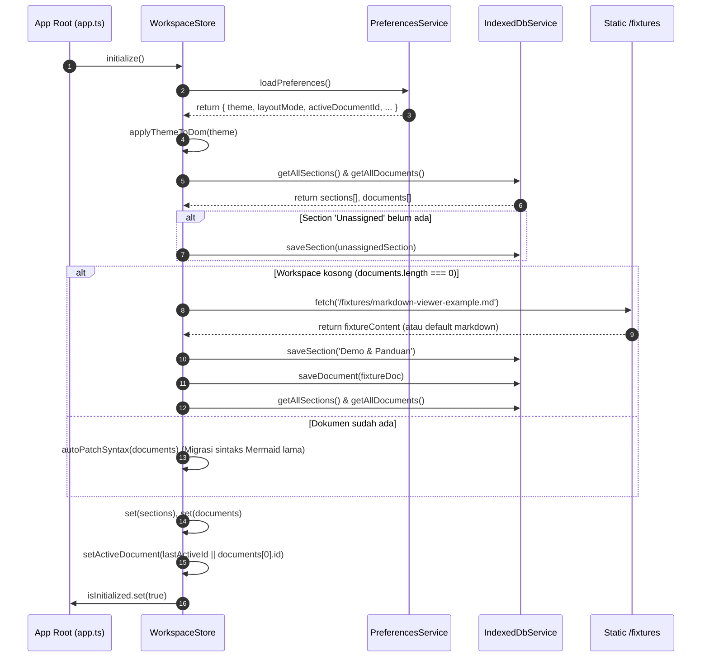
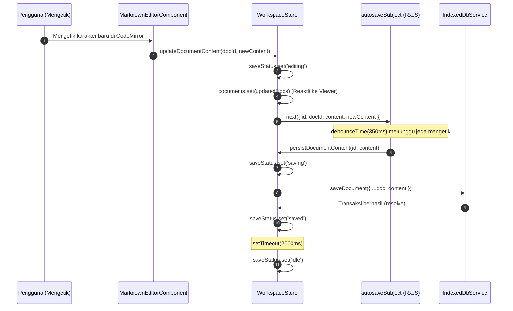
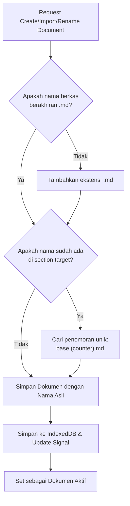
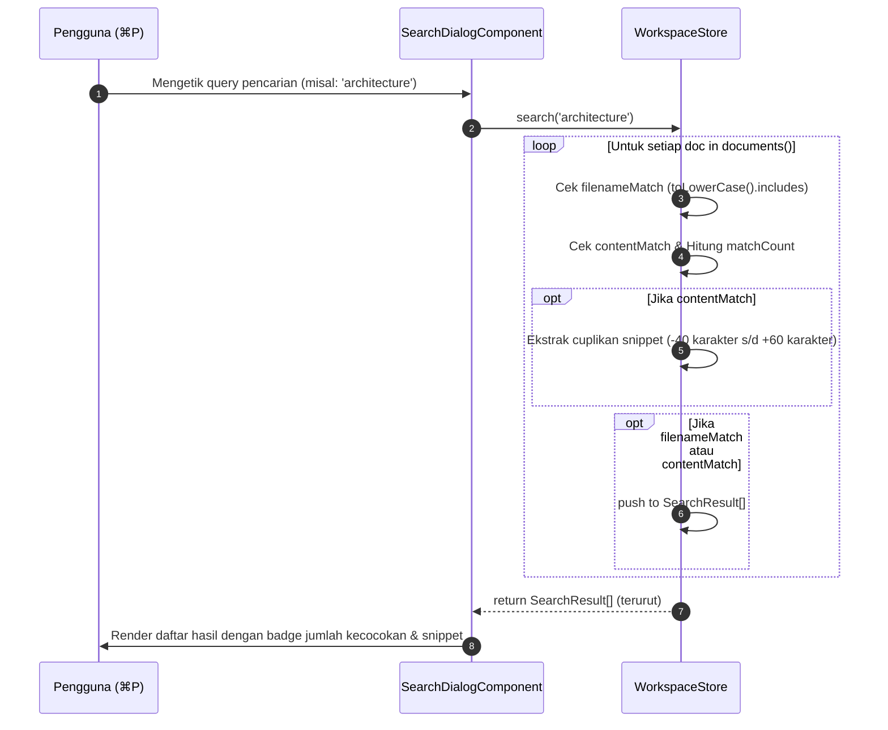
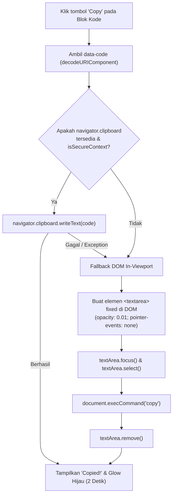

# 04. Logic, State Management & Application Flows
**Project:** Nobody Markdown Viewer (v1.0.5+)  
**Category:** State Management, Data Flow & Lifecycle Specification

---

## 1. Arsitektur Reaktivitas Angular Signals

Aplikasi sepenuhnya mengadopsi primitif reaktivitas Angular modern (**Signals**, **Computed**, dan **Effects**) di dalam [`WorkspaceStore`](file:///Users/mypro/gengs/ai-research/markdown-viewer/src/app/core/services/workspace.store.ts):

```mermaid
graph TD
    subgraph Writable Signals [State Utama (Writable Signals)]
        S1["sections: Signal&lt;Section[]&gt;"]
        S2["documents: Signal&lt;MarkdownDocument[]&gt;"]
        S3["activeDocumentId: Signal&lt;string \| null&gt;"]
        S4["saveStatus: Signal&lt;SaveStatus&gt;"]
        S5["theme: Signal&lt;ThemeMode&gt;"]
        S6["themeVersion: Signal&lt;number&gt;"]
        S7["layoutMode: Signal&lt;LayoutMode&gt;"]
    end

    subgraph Computed Signals [State Turunan (Computed Signals)]
        C1["activeDocument: computed()"]
        C2["outline: computed&lt;OutlineItem[]&gt;"]
        C3["chunks: computed&lt;ViewerChunk[]&gt; (in Viewer)"]
    end

    subgraph Effects & UI [Reaksi & Sinkronisasi]
        E1["DOM [data-theme] Attribute Sync"]
        E2["Mermaid Re-render on themeVersion"]
        E3["CodeMirror Compartment Reconfiguration"]
        E4["Debounced Autosave Pipeline (350ms)"]
    end

    S2 --> C1
    S3 --> C1
    C1 --> C2
    C1 --> C3
    S5 --> E1
    S6 --> E2
    S5 --> E3
```

---

## 2. Alur Inisialisasi Workspace & Seeding (Startup Flow)

Saat aplikasi pertama kali dibuka di browser pengguna, urutan inisialisasi berjalan sebagai berikut:



---

## 3. Alur Autosave & Mutasi Konten (Debounced Autosave Pipeline)

Mengetik di editor CodeMirror memicu alur penyimpanan ter-debounce untuk menghemat I/O IndexedDB:



---

## 4. Alur Manajemen Dokumen & Penanganan Duplikasi Nama

Setiap dokumen di dalam section yang sama dijamin memiliki nama yang unik:



---

## 5. Alur Pencarian Cepat Global (Full-Text Search Engine)

Pencarian dijalankan secara in-memory melintasi seluruh koleksi dokumen di Signal `documents()`:



---

## 6. Alur Salin Kode ke Clipboard (Copy Pipeline & Fallback)

Diimplementasikan pada [`clipboard.util.ts`](file:///Users/mypro/gengs/ai-research/markdown-viewer/src/app/core/utils/clipboard.util.ts) dan [`MarkdownViewerComponent`](file:///Users/mypro/gengs/ai-research/markdown-viewer/src/app/features/markdown-viewer/markdown-viewer.component.ts):


