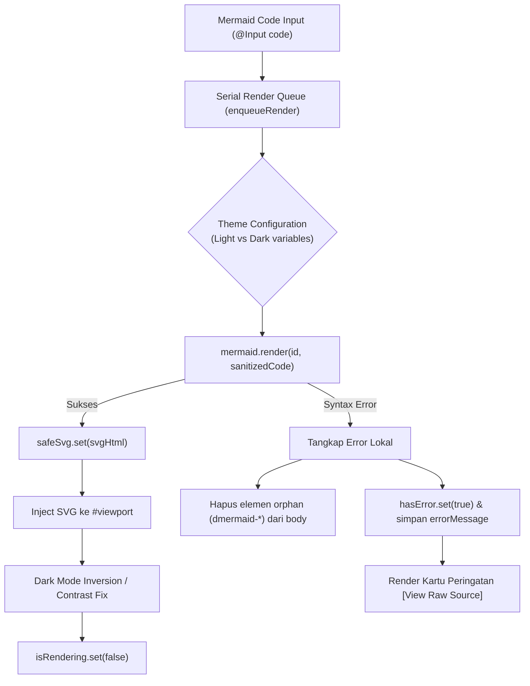

# 06. Core Engines Deep Dive
**Project:** Nobody Markdown Viewer (v1.0.5+)  
**Category:** Technical Engine Internals & Rendering Pipelines

---

## 1. Engine 1: Markdown GFM & Syntax Highlighting

Dikelola di [`MarkdownViewerComponent`](file:///Users/mypro/gengs/ai-research/markdown-viewer/src/app/features/markdown-viewer/markdown-viewer.component.ts):

### 1.1 Strategi Chunking Dokumen (`parseDocumentChunks`)
Alih-alih memparsing seluruh dokumen sebagai satu string raksasa, markdown dipecah menjadi array terstruktur `ViewerChunk[]`:
```typescript
interface ViewerChunk {
  id: string;
  type: 'markdown' | 'mermaid';
  content: string;
  renderedHtml?: SafeHtml;
}
```
Regex pemecah:
```regexp
/(?:^|\n)```mermaid\r?\n([\s\S]*?)\r?\n```/g
```
**Keuntungan Arsitektural:**
1. **Virtualisasi Render:** Komponen diagram Mermaid diisolasi ke dalam Angular standalone component terpisah (`<app-mermaid-renderer>`) yang memiliki siklus hidup mandiri.
2. **Efisiensi Memori & Re-render:** Perubahan pada teks naratif markdown biasa tidak memaksa diagram Mermaid untuk dihitung atau dirender ulang dari nol.

### 1.2 Custom Code Block Renderer dengan Salin Kode
Setiap blok kode diproses menggunakan custom renderer Marked:
```typescript
const renderer = {
  code: ({ text, lang }: { text: string; lang?: string }) => {
    const language = lang && hljs.getLanguage(lang) ? lang : undefined;
    const highlighted = language ? hljs.highlight(text, { language }).value : escapeHtml(text);
    const displayLang = (lang || 'code').toUpperCase();
    const encodedCode = encodeURIComponent(text);

    return `
      <div class="code-block-wrapper">
        <div class="code-block-header">
          <span class="code-lang">${displayLang}</span>
          <button type="button" class="code-copy-btn" data-copy-btn="true" data-code="${encodedCode}">
            <svg class="copy-icon" ...></svg>
            <span class="copy-label">Copy</span>
          </button>
        </div>
        <pre><code class="hljs ${language || ''}">${highlighted}</code></pre>
      </div>`;
  }
};
```
- **Preservasi Karakter:** `encodeURIComponent(text)` menjamin indentasi, spasi ganda, dan karakter khusus tersimpan sempurna tanpa distorsi saat disalin.

---

## 2. Engine 2: Mermaid 11.17.2 Rendering & Error Boundary

Dikelola di [`MermaidRendererComponent`](file:///Users/mypro/gengs/ai-research/markdown-viewer/src/app/features/markdown-viewer/mermaid-renderer.component.ts):



### 2.1 Pinned Version & Integrasi ZenUML Eksternal
- Library dipatok tepat ke versi **`mermaid@11.17.2`** guna menjamin stabilitas 30+ diagram families.
- Paket eksternal `@mermaid-js/mermaid-zenuml` didaftarkan saat startup:
  ```typescript
  mermaid.registerExternalDiagrams([zenuml]);
  ```

### 2.2 Serialized Render Queue (`enqueueRender`)
Mermaid menggunakan manipulasi DOM global untuk menghitung dimensi layout SVG. Untuk mencegah tabrakan ID SVG atau *race conditions* saat puluhan diagram dimuat bersamaan, rendering diantrekan secara serial melalui Promise chaining:
```typescript
let renderQueue = Promise.resolve();
function enqueueRender<T>(fn: () => Promise<T>): Promise<T> {
  const result = renderQueue.then(fn, fn);
  renderQueue = result.then(() => {}, () => {});
  return result;
}
```

### 2.3 Preservasi Viewport DOM (Solusi Bug Toggle Source)
Untuk mencegah hilangnya SVG saat beralih antara tampilan Diagram dan Raw Source, elemen `#viewport` **tidak menggunakan `@if`**, melainkan atribut `[hidden]`:
```html
<div #viewport class="diagram-viewport" [hidden]="showSource() || hasError()">
  <div class="diagram-content" [innerHTML]="safeSvg()" [style.transform]="transformStyle()"></div>
</div>
```
Node SVG tetap hidup di DOM, sehingga transisi bolak-balik instan 0 milidetik tanpa re-render.

### 2.4 Error Containment & Pembersihan Orphan Element
Saat Mermaid gagal mem-parse diagram, secara default Mermaid menyisipkan elemen SVG error ke `document.body`. Handler membersihkan elemen liar tersebut:
```typescript
const orphanElements = document.querySelectorAll('svg[id^="dmermaid-"]');
orphanElements.forEach((el) => el.remove());
```
Ini menjamin antarmuka workspace tetap bersih dari elemen liar.

---

## 3. Engine 3: CodeMirror 6 Editor

Dikelola di [`MarkdownEditorComponent`](file:///Users/mypro/gengs/ai-research/markdown-viewer/src/app/features/markdown-editor/markdown-editor.component.ts):

### 3.1 Arsitektur Editor State & Dynamic Compartment
CodeMirror 6 berbasis ekstensi fungsional modular. Untuk mendukung peralihan tema (Light vs Dark) tanpa merusak teks atau riwayat undo/redo, digunakan `Compartment`:
```typescript
private themeCompartment = new Compartment();

// Saat inisialisasi:
const state = EditorState.create({
  doc: activeDoc.content,
  extensions: [
    basicSetup,
    markdown(),
    history(),
    keymap.of([...defaultKeymap, ...historyKeymap, ...searchKeymap]),
    this.themeCompartment.of(isDark ? oneDark : []),
    EditorView.updateListener.of((update: ViewUpdate) => {
      if (update.docChanged) {
        this.onContentChange(update.state.doc.toString());
      }
    }),
  ],
});
```

### 3.2 Sinkronisasi Perubahan Tema
Saat signal `theme()` di store berubah, ekstensi tema di-dispatch ulang secara langsung tanpa me-recreate instance editor:
```typescript
effect(() => {
  const theme = this.workspaceStore.theme();
  const isDark = ...;
  this.editorView.dispatch({
    effects: this.themeCompartment.reconfigure(isDark ? oneDark : []),
  });
});
```
