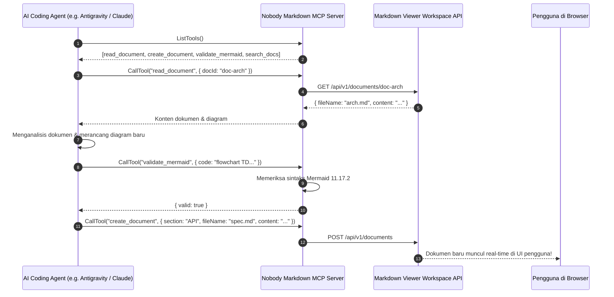
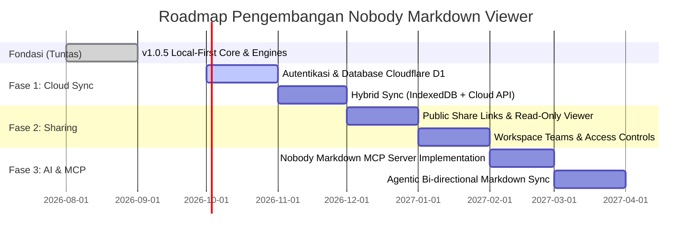

# 07. Future Roadmap & MCP Readiness Blueprint
**Project:** Nobody Markdown Viewer (v1.0.5+)  
**Category:** Strategic Architecture, Backend Transition & Model Context Protocol (MCP) Roadmap

---

## 1. Visi Grand Plan: Transformasi Menuju Platform Data-Driven & AI

Grand plan proyek ini adalah mengubah **Nobody Markdown Viewer** dari aplikasi statis lokal (*static file viewer*) menjadi **workspace cerdas berbasis data terdistribusi**, yang memungkinkan:
1. **Penyimpanan Berbasis Backend & Cloud Persistence**: Dokumen tidak lagi hanya tersimpan di browser IndexedDB pengguna, tetapi tersinkronisasi ke database awan.
2. **Berbagi Konten & Kolaborasi (Content Sharing & Collaboration)**: Kemampuan membagikan dokumen atau section via link publik/privat, hak akses berjenjang, dan kolaborasi real-time.
3. **Integrasi Model Context Protocol (MCP)**: Membuka antarmuka workspace ke ekosistem AI Agents (Claude, Antigravity, Cursor) untuk membaca, memvalidasi, membuat diagram, dan mengelola basis pengetahuan secara otonom.

---

## 2. Arsitektur Transisi Backend (From Local-First to Hybrid-Sync)

```mermaid
graph TD
    subgraph Client Layer [Frontend Client (Angular 20 SPA)]
        UI["Nobody Markdown Viewer UI"]
        LocalStore["WorkspaceStore (Signals)"]
        SyncEngine["Sync & Conflict Resolver (CRDT / Reconnect Buffer)"]
        LocalDB["IndexedDB (Offline Cache)"]
    end

    subgraph Edge & API Gateway [Edge & Serverless Layer]
        Worker["Cloudflare Workers API Gateway"]
        Auth["Auth Service (OAuth / Cloudflare Access / JWT)"]
    end

    subgraph Data & Storage Layer [Cloud Data Persistence]
        D1["Cloudflare D1 (Serverless SQL) / Supabase PG"]
        R2["Cloudflare R2 (Asset & Image Attachments)"]
        KV["Cloudflare KV (Shared Snapshot Caching)"]
    end

    subgraph AI & MCP Layer [Model Context Protocol]
        MCPServer["Markdown Viewer MCP Server"]
        AIAgents["AI Coding Agents (Antigravity, Claude, Cursor)"]
    end

    UI <--> LocalStore
    LocalStore <--> SyncEngine
    SyncEngine <--> LocalDB
    SyncEngine <-->|HTTPS / WSS| Worker
    Worker --> Auth
    Worker <--> D1
    Worker <--> R2
    Worker <--> KV

    MCPServer <-->|JSON-RPC / stdio / SSE| AIAgents
    MCPServer <--> Worker
```

### 2.1 Pemetaan Skema Database Relasional (SQL Schema)
Struktur entitas TypeScript saat ini (`Section` dan `MarkdownDocument`) telah siap dipetakan langsung ke tabel database:

```sql
-- Tabel Pengguna & Ruang Kerja
CREATE TABLE workspaces (
    id VARCHAR(64) PRIMARY KEY,
    owner_id VARCHAR(64) NOT NULL,
    name VARCHAR(255) NOT NULL,
    created_at TIMESTAMP WITH TIME ZONE DEFAULT CURRENT_TIMESTAMP,
    updated_at TIMESTAMP WITH TIME ZONE DEFAULT CURRENT_TIMESTAMP
);

-- Tabel Section
CREATE TABLE sections (
    id VARCHAR(64) PRIMARY KEY,
    workspace_id VARCHAR(64) REFERENCES workspaces(id) ON DELETE CASCADE,
    name VARCHAR(255) NOT NULL,
    display_order INT NOT NULL DEFAULT 0,
    is_system BOOLEAN DEFAULT FALSE,
    collapsed BOOLEAN DEFAULT FALSE,
    created_at TIMESTAMP WITH TIME ZONE DEFAULT CURRENT_TIMESTAMP,
    updated_at TIMESTAMP WITH TIME ZONE DEFAULT CURRENT_TIMESTAMP
);

-- Tabel Dokumen Markdown
CREATE TABLE documents (
    id VARCHAR(64) PRIMARY KEY,
    section_id VARCHAR(64) REFERENCES sections(id) ON DELETE CASCADE,
    file_name VARCHAR(255) NOT NULL,
    title VARCHAR(255),
    content TEXT NOT NULL,
    display_order INT NOT NULL DEFAULT 0,
    source_type VARCHAR(32) DEFAULT 'created',
    created_at TIMESTAMP WITH TIME ZONE DEFAULT CURRENT_TIMESTAMP,
    updated_at TIMESTAMP WITH TIME ZONE DEFAULT CURRENT_TIMESTAMP
);

-- Tabel Berbagi Link (Sharing)
CREATE TABLE share_links (
    id VARCHAR(64) PRIMARY KEY, -- Slug unik share (misal: 'nobody.sh/s/a8f9c1')
    document_id VARCHAR(64) REFERENCES documents(id) ON DELETE CASCADE,
    workspace_id VARCHAR(64) REFERENCES workspaces(id) ON DELETE CASCADE,
    permission VARCHAR(16) DEFAULT 'read_only', -- 'read_only' | 'can_comment' | 'can_edit'
    passcode_hash VARCHAR(255),
    expires_at TIMESTAMP WITH TIME ZONE
);
```

---

## 3. Desain Fitur Berbagi Konten (Content Sharing Engine)

1. **Snapshot Read-Only View (`/share/:slug`)**:
   - Pengguna dapat mengklik tombol *Share* pada dokumen atau section.
   - Sistem menghasilkan link publik unik yang dapat diakses siapa saja (atau diproteksi PIN).
   - Saat link dibuka, antarmuka memuat mode khusus *Viewer Only* tanpa panel editor atau explorer, memberikan pengalaman membaca dokumen teknis dan diagram yang bersih dan profesional.
2. **Kolaborasi Real-Time (Live Collaborative Editing)**:
   - Integrasi `Yjs` atau `Automerge` dengan CodeMirror 6 (`y-codemirror.next`).
   - Perubahan teks dan diagram tersinkronisasi antar pengguna secara peer-to-peer atau melalui WebSocket edge room (Cloudflare Durable Objects).

---

## 4. Arsitektur Model Context Protocol (MCP)

Integrasi MCP memungkinkan Nobody Markdown Viewer menjadi jembatan antara dokumentasi teknis dan kecerdasan buatan (AI):



### 4.1 Spesifikasi Tools MCP yang Akan Diekspos

| Tool Name | Parameter | Deskripsi Fungsi |
|---|---|---|
| `list_workspace_sections` | `{ workspaceId?: string }` | Mengembalikan daftar seluruh section dan hierarki dokumen aktif. |
| `read_markdown_document` | `{ documentId: string }` | Mengambil teks mentah dokumen, metadata, dan daftar heading H1–H6. |
| `search_technical_docs` | `{ query: string, sectionId?: string }` | Pencarian semantik dan teks penuh melintasi seluruh dokumentasi. |
| `upsert_document` | `{ sectionId: string, fileName: string, content: string }` | Membuat dokumen baru atau memperbarui dokumen yang sudah ada. |
| `validate_mermaid_diagram`| `{ code: string }` | Memvalidasi sintaks diagram sebelum dimasukkan ke dalam dokumen. |
| `export_workspace_bundle`| `{ format: "zip" \| "json" }` | Mengunduh seluruh workspace sebagai arsip untuk konteks AI. |

---

## 5. Tahapan Roadmap Implementasi (Milestones)



1. **Milestone 1 (Selesai - Current v1.0.5)**: Local-first SPA, 3-panel resizable layout, Mermaid 11.17.2 dengan isolasi error, CodeMirror 6 dengan autosave, pencarian instan `⌘P`, dark mode kontras tinggi, dan deployment Cloudflare Workers Static Assets.
2. **Milestone 2 (Backend & Cloud Persistence)**: Integrasi Cloudflare D1 / PostgreSQL, autentikasi multi-tenant, dan background sync engine.
3. **Milestone 3 (Content Sharing & Read-Only Links)**: Generator link berbagi publik/privat, proteksi kata sandi, dan tampilan viewer terisolasi.
4. **Milestone 4 (Model Context Protocol / MCP)**: Peluncuran Nobody Markdown MCP Server yang memungkinkan AI agent membaca dan menulis langsung ke workspace pengguna secara terotomasi.
