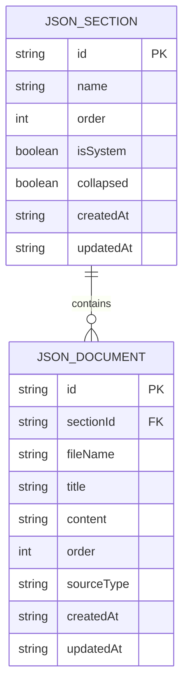
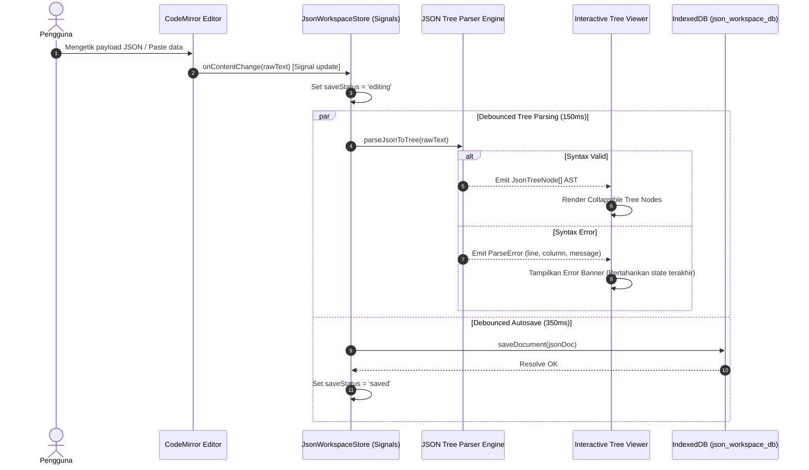

# Product Requirements Document (PRD) — Local Technical JSON Workspace

**Document:** `docs/feature-json-previewer/PRD-json.md`  
**Feature:** Local Technical JSON Previewer & Formatter Workspace  
**Parent Project:** Nobody Markdown Viewer (`ai-research/markdown-viewer`)  
**Architecture Paradigm:** Local-First Single Page Application (SPA)  
**Target Platform:** Modern Desktop Web Browser  
**Frontend Stack:** Angular 20 (Signals, Standalone Components), CodeMirror 6 (`@codemirror/lang-json`), IndexedDB, DOMPurify  
**Backend / External Services:** None (Zero-Backend / 100% Client-Side)  
**Persistence Engine:** Browser-local IndexedDB (`json_workspace_db`) + LocalStorage UI preferences  
**Document Status:** Implementation-Ready Master Specification  
**Priority:** V1

---

## 1. Executive Summary & Visi Produk

### 1.1 Latar Belakang
Pengembang perangkat lunak, arsitek sistem, dan insinyur data sering kali berhadapan dengan dokumen spesifikasi teknis (seperti PRD, ADR, desain API) yang bersanding erat dengan struktur data JSON riil (payload API request/response, skema konfigurasi, metadata JSON-LD). 

Saat ini, Nobody Markdown Viewer telah berhasil menyediakan pengalaman membaca dan menyunting dokumen Markdown lokal yang privat dan cepat. Namun, ketika pengguna perlu memeriksa atau merapikan data JSON, mereka terpaksa beralih ke aplikasi online pihak ketiga (yang berisiko membocorkan data rahasia) atau editor teks umum yang berat dan tidak terorganisir.

### 1.2 Visi Produk
**Nobody JSON Previewer** adalah ruang kerja (*workspace*) inspeksi, pemformatan, dan pengelolaan berkas JSON teknis lokal-pertama (*local-first*) yang terintegrasi di dalam satu platform. 

Pengguna dapat mengorganisir berkas-berkas JSON ke dalam **Sections** (seperti halnya Markdown Workspace), menavigasi struktur objek hierarkis menggunakan **Interactive Tree Viewer**, serta menyunting dan memformat data menggunakan **CodeMirror 6 JSON Editor** dengan validasi sintaks instan tanpa sedikit pun data meninggalkan browser pengguna.

---

## 2. Product Positioning & Non-Functional Requirements

### 2.1 Prinsip Desain Utama
1. **Zero-Backend & 100% Local-First**: Seluruh data JSON disimpan secara lokal di mesin pengguna via IndexedDB (`json_workspace_db`). Tidak ada telemetri data, tidak ada API server, dan tidak ada risiko kebocoran data sensitif.
2. **Kerapian & Isolasi Workspace**: Fitur JSON memiliki database dan alur state mandiri sehingga stabilitas dokumen Markdown yang telah ada tetap terisolasi 100% tanpa risiko regresi.
3. **Viewer-Dominant Ergonomics**: Layout 3-panel yang fleksibel dan ergonomis, memprioritaskan kemudahan visualisasi pohon hierarki data (Tree View) dengan dukungan CodeMirror Editor di sampingnya untuk modifikasi cepat.
4. **Theme & Design System Harmony**: Mengadopsi design tokens yang sama dengan Nobody Markdown Viewer (`src/styles.scss`), mendukung perpindahan mulus antara Mode Light, Dark, dan System dengan kontras tinggi (> 7:1).

### 2.2 Batasan Teknis (Constraints)
- Tidak ada autentikasi atau login pengguna.
- Aplikasi harus tetap dapat dibundel sebagai Angular SPA statis dan di-deploy ke Cloudflare Workers Static Assets / Cloudflare Pages.
- Rendering pohon JSON harus tangguh terhadap file berukuran hingga 5MB tanpa membekukan antarmuka browser.

---

## 3. UI/UX Architecture & Entry Point Specification

Berdasarkan keputusan arsitektur, integrasi UI/UX menggunakan pendekatan **Header Mode Switcher** dengan dukungan **3-Panel Workspace Layout**.

### 3.1 Top Header Mode Switcher
Di bagian header atas ([`HeaderComponent`](file:///Users/mypro/gengs/ai-research/markdown-viewer/src/app/features/shell/header.component.ts)), ditambahkan kontrol tersegmentasi (*segmented control*) yang elegan untuk beralih mode workspace antara **Markdown** dan **JSON**:

```text
+---------------------------------------------------------------------------------------------------------+
| [Logo] Nobody  | [ 📝 Markdown | { } JSON ] |  [🔍 Search...]       [Status Pill]   [Import] [Export] [Theme]|
+---------------------------------------------------------------------------------------------------------+
```

#### Spesifikasi Header:
- **Lokasi:** Terletak di sebelah kanan nama brand *"Nobody"*, sebelum Search trigger.
- **Visual Design:**
  - Kontainer pill kapsul berlatar `var(--color-bg-subtle)` dengan border halus `1px solid var(--color-border)`.
  - Item aktif memiliki latar belakang `var(--color-primary)` dengan teks putih terang dan elevasi bayangan halus `var(--shadow-sm)`.
  - Transisi mulus `var(--transition-fast)` saat mouse hover dan switch.
- **Keyboard Shortcut:** `⌘1` untuk Markdown Workspace, `⌘2` untuk JSON Workspace.
- **State Persistence:** Mode aktif terakhir disimpan di LocalStorage (`nobody_active_workspace_app: 'markdown' | 'json'`) sehingga saat halaman di-*refresh*, pengguna kembali ke ruang kerja yang sama.

---

### 3.2 Arsitektur Layout 3-Panel JSON Workspace

Layout utama diatur oleh komponen `JsonMainLayoutComponent` dengan pembagian fungsi sebagai berikut:

```text
+---------------------------------------------------------------------------------------------------------+
|                                           APP HEADER BAR                                                |
| [Logo Nobody] [ 📝 Markdown | { } JSON ]       [⌘P Search...]   [Saved locally]  [Import JSON] [Layout] |
+-----------------------+---+---------------------------------------------------+---+---------------------+
|   JSON RESOURCE PANEL | S |                 JSON TREE VIEWER                  | S |   JSON CODE EDITOR  |
| (Explorer & Metadata) | P |           (Visualizer Interaktif Hierarkis)       | P | (CodeMirror 6 JSON) |
|                       | L |                                                   | L |                     |
| - Section Accordions  | I | - Breadcrumb Path (root.users[0].name)            | I | - Format (Prettify) |
| - JSON Files List     | T | - Controls (Expand All / Collapse All / Depth)    | T | - Minify (Compact)  |
| - Filter Files Box    | T | - Type Badges (str, num, bool, null, obj, arr)    | T | - Sort Keys (A-Z)   |
| - New Section Modal   | E | - Copy Value / Copy Key / Copy JSONPath           | E | - Realtime Linting  |
| - Drag-Drop Import    | R | - Filter/Search within Tree Nodes                 | R | - Autosave Status   |
| (Width: 200px-500px)  | 1 | (Flex: 1, Min-Width: 320px)                       | 2 | (Width: 260px-600px)|
+-----------------------+---+---------------------------------------------------+---+---------------------+
```

---

### 3.3 Detail Komponen 3-Panel

#### 1. Panel Kiri: JSON Resource Explorer (`app-json-resource-panel`)
- **Fungsi:** Mengelola struktur organisasi berkas JSON.
- **Section Accordion:** Pengguna dapat membuat Section baru (misal: `"Auth Payloads"`, `"Config Files"`, `"Responses"`).
- **Unassigned Fallback Section:** Berkas JSON yang diimpor tanpa section akan otomatis masuk ke seksi *Unassigned*.
- **Drag & Drop Reordering:** Mengurutkan berkas JSON antar section menggunakan Angular CDK Drag & Drop.
- **Filter Berkas:** Kolom input pencarian cepat untuk memfilter nama berkas JSON secara instan.
- **File Meta Tag:** Menampilkan ukuran berkas (`KB`) dan jumlah key level teratas di samping nama berkas.

#### 2. Panel Tengah: Interactive JSON Tree Viewer (`app-json-tree-viewer`)
- **Fungsi:** Visualisasi hierarki JSON dalam format pohon interaktif yang mudah dibaca.
- **Collapsible Nodes:** Setiap objek `{...}` dan array `[...]` dapat dilipat/dibuka dengan indikator jumlah item (misal: `{ 12 keys }`, `[ 48 items ]`).
- **Depth Presets:** Tombol aksi cepat untuk melipat/membuka pada kedalaman tertentu (`Collapse All`, `Level 1`, `Level 2`, `Expand All`).
- **Color-Coded Types:** Pewarnaan konsisten sesuai design token untuk membedakan tipe data primitif:
  - `string`: Hijau Emerald (`--color-success`)
  - `number`: Biru Amber (`#f59e0b`)
  - `boolean`: Indigo / Ungu (`--color-primary`)
  - `null`: Abu-abu Muted (`--color-text-tertiary`)
- **Copy Actions Per-Node:**
  - *Copy Value*: Menyalin nilai murni ke clipboard.
  - *Copy Key*: Menyalin nama atribut/kunci.
  - *Copy JSONPath*: Menghasilkan path evaluasi (contoh: `data.items[2].attributes.title`).
- **Search within JSON:** Kolom pencarian di bagian atas viewer untuk menyorot (*highlight*) dan menyaring node berdasarkan key atau value yang cocok.
- **Breadcrumb Navigation:** Menampilkan path aktif dari node yang sedang dipilih pengguna.

#### 3. Panel Kanan: CodeMirror 6 JSON Editor & Formatter (`app-json-editor`)
- **Fungsi:** Menyunting teks JSON mentah secara real-time dengan bantuan formatting engine modern.
- **Toolbar Actions:**
  - **Prettify 2 Spaces:** Merapikan indentasi JSON standar 2 spasi.
  - **Prettify 4 Spaces:** Merapikan indentasi JSON 4 spasi.
  - **Minify:** Menghapus seluruh whitespace dan newline menjadi format satu baris padat (*compact payload*).
  - **Sort Keys (Alphabetical):** Mengurutkan key objek secara alfabetis (A-Z) secara rekursif.
  - **Copy JSON:** Menyalin seluruh isi JSON yang telah diformat ke clipboard.
  - **Clear:** Mengosongkan editor dengan konfirmasi.
- **Real-Time Linting & Error Boundary:**
  - Mengintegrasikan linter JSON bawaan CodeMirror.
  - Jika terdapat syntax error (misalnya trailing comma atau tanda kutip hilang), penanda merah akan muncul tepat pada nomor baris dan kolom yang bermasalah beserta pesan kesalahan yang jelas.
  - Tree Viewer di panel tengah akan menampilkan peringatan informatif (*"Invalid JSON syntax in editor"*) tanpa mengalami crash.
- **Debounced Autosave (350ms):** Perubahan teks otomatis disimpan ke IndexedDB setelah pengguna berhenti mengetik selama 350ms.

---

### 3.4 Lima Mode Layout Preset (Layout Modes)
Mendukung 5 preset layout yang sama dengan workspace Markdown:
1. **Default (3 Panels):** Explorer + Tree Viewer + Editor aktif bersamaan.
2. **Viewer Dominant:** Explorer + Tree Viewer aktif, Editor terlipat (fokus inspeksi data).
3. **Viewer Only:** Tree Viewer layar penuh (bebas distraksi).
4. **Editor Only:** CodeMirror JSON Editor layar penuh (fokus penyusunan payload).
5. **Viewer + Editor:** Tree Viewer di kiri dan Editor di kanan (eksplorasi visual ganda).

---

## 4. Spesifikasi Model Data & Skema Persistence

### 4.1 Isolasi Database IndexedDB (`json_workspace_db`)
Untuk menjaga integritas dan performa, fitur JSON memiliki database tersendiri:
- **Nama Database:** `json_workspace_db`
- **Versi:** `1`
- **Object Stores:**
  1. `json_sections`: Menyimpan kelompok/kategori berkas JSON.
  2. `json_documents`: Menyimpan payload dan metadata berkas JSON.



### 4.2 TypeScript Model Interfaces

```typescript
// src/app/core/models/json-workspace.models.ts

export interface JsonSection {
  id: string;
  name: string;
  order: number;
  isSystem: boolean; // true untuk sistem "Unassigned"
  collapsed: boolean;
  createdAt: string;
  updatedAt: string;
}

export interface JsonDocument {
  id: string;
  sectionId: string;
  fileName: string;
  title?: string;
  content: string; // Serialized raw JSON string
  order: number;
  sourceType: 'imported' | 'created';
  createdAt: string;
  updatedAt: string;
}

export interface JsonWorkspacePreferences {
  resourcePanelWidth: number;
  editorPanelWidth: number;
  layoutMode: 'default' | 'viewer-dominant' | 'viewer-only' | 'editor-only' | 'viewer-editor';
  activeDocumentId?: string;
  indentation: 2 | 4 | 'tab';
  autoSortKeys: boolean;
  expandDepth: number;
}

export interface JsonTreeNode {
  id: string;
  key: string;
  value: any;
  type: 'object' | 'array' | 'string' | 'number' | 'boolean' | 'null';
  path: string; // Contoh: "users[0].address.city"
  depth: number;
  itemCount?: number;
  isExpanded: boolean;
  children?: JsonTreeNode[];
}

export const UNASSIGNED_JSON_SECTION_ID = 'unassigned-json-section-id';
```

---

## 5. Logic & State Flows

### 5.1 Siklus Sinkronisasi Dua Arah (Editor ↔ Viewer)



### 5.2 Alur Pemformatan Data (Formatting Engine)
1. **Prettify / Beautify:**
   - Membaca konten string aktif dari `JsonWorkspaceStore`.
   - Menjalankan `JSON.parse(rawText)`.
   - Mengubah kembali menjadi string terformat: `JSON.stringify(parsed, null, indentSpaces)`.
   - Memperbarui CodeMirror Editor view transaction dan memicu autosave.
2. **Minify:**
   - Menjalankan `JSON.stringify(JSON.parse(rawText))` tanpa argumen spasi.
3. **Sort Keys (Alphabetical Sorting):**
   - Menggunakan fungsi pengurutan rekursif yang mengurutkan semua kunci objek secara leksikografis (A-Z) pada setiap level hierarki sebelum serialisasi.

---

## 6. Rencana Struktur Direktori & File Mapping

```text
src/app/
├── core/
│   ├── models/
│   │   ├── workspace.models.ts         # (Eksisting) Markdown models
│   │   └── json-workspace.models.ts    # [BARU] Interface JsonSection, JsonDocument, Tree
│   ├── services/
│   │   ├── workspace.store.ts          # (Eksisting) Markdown Signals store
│   │   ├── json-workspace.store.ts     # [BARU] Store reaktif JSON workspace
│   │   ├── json-formatter.service.ts   # [BARU] Utilitas format, minify, sort-keys
│   │   └── export.service.ts           # [UPDATE] Ekspor ZIP/File JSON
│   └── storage/
│       ├── indexeddb.service.ts        # (Eksisting) DB Markdown
│       └── json-indexeddb.service.ts   # [BARU] DB Persistence 'json_workspace_db'
└── features/
    ├── json-previewer/                 # [BARU] Modul Fitur JSON Previewer
    │   ├── json-main-layout.component.ts # Container 3-panel dengan splitters
    │   ├── json-header-mode.component.ts # Tombol segmented switch di Header
    │   ├── viewer/
    │   │   ├── json-tree-viewer.component.ts # Header viewer, breadcrumbs & search
    │   │   └── json-tree-node.component.ts   # Recursive tree node component
    │   ├── editor/
    │   │   └── json-editor.component.ts      # CodeMirror 6 dengan JSON linter
    │   └── resources/
    │       ├── json-resource-panel.component.ts # Explorer container & file filter
    │       └── json-section-list.component.ts   # Accordion sections & file items
    └── shell/
        ├── header.component.ts         # [UPDATE] Menyematkan segmented switcher
        └── main-layout.component.ts    # (Eksisting) Layout Markdown
```

---

## 7. Tahapan Implementasi Bertahap (Milestones Roadmap)

| Fase | Milestone | Deliverable Utama | Perkiraan Lingkup |
|:---:|---|---|---|
| **Fase 1** | **Fondasi Data & Storage** | - Model data TypeScript `json-workspace.models.ts`<br>- Service IndexedDB `json-indexeddb.service.ts`<br>- State Store `json-workspace.store.ts` | Backend lokal & struktur state |
| **Fase 2** | **Header Entry & Navigation Shell** | - Switcher `[ 📝 Markdown \| { } JSON ]` pada Header<br>- Pengkondisian root component (`app.html`) menampilkan layout sesuai mode aktif<br>- Persistence mode aktif di LocalStorage | UI Switcher & Layout Orchestration |
| **Fase 3** | **JSON Resource Explorer** | - Accordion Sections (`JsonSectionList`)<br>- Import file `.json` via drag-and-drop & file picker<br>- Quick filter nama file & create new section modal | Manajemen Berkas JSON |
| **Fase 4** | **Interactive Tree Viewer** | - Komponen pohon rekursif (`JsonTreeNodeComponent`)<br>- Badging tipe data berwarna, collapsing/expanding<br>- Fitur Copy Value, Copy Key, Copy JSONPath<br>- Search & Filter dalam pohon JSON | Renderer Visual Hierarki |
| **Fase 5** | **CodeMirror JSON Editor & Formatter** | - CodeMirror 6 dengan `@codemirror/lang-json`<br>- Syntax linting & pinpoint error boundary<br>- Action bar: Prettify 2/4 spasi, Minify, Sort Keys A-Z<br>- Debounced autosave 350ms ke IndexedDB | Editor & Formatter Engine |
| **Fase 6** | **Polish, Shortcut & Uji Coba** | - Integrasi shortcut global (`⌘1`, `⌘2`, `⌘S`, `⌘P`)<br>- Uji beban dengan file JSON berukuran besar (1MB - 5MB)<br>- Optimasi rendering & validasi tema High-Contrast | QA, Testing & Polish |

---

## 8. Skenario Pengujian & Kriteria Penerimaan (Acceptance Criteria)

### 8.1 Acceptance Criteria (AC)
1. **Pemisahan Mode:** Mengklik tab `{ } JSON` pada header beralih seketika ke JSON Workspace tanpa mereset atau mengganggu dokumen Markdown yang sedang aktif.
2. **Isolasi Data:** Berkas dan section JSON tersimpan permanen di IndexedDB `json_workspace_db`. Jika aplikasi di-refresh, seluruh dokumen JSON tetap utuh.
3. **Pohon Interaktif:** Pengguna dapat melipat dan membuka node objek/array, serta menyalin nilai maupun JSONPath yang valid dengan 1 klik.
4. **Validasi Sintaks:** Jika pengguna memasukkan JSON tidak valid di editor, Tree Viewer tidak mengalami error fatal; sistem menampilkan pesan error yang ramah dan menandai baris yang salah di editor.
5. **Formatting:** Menekan tombol *Prettify* merapikan string berantakan menjadi JSON rapi; menekan *Minify* memadatkan JSON tanpa merusak data; menekan *Sort Keys* mengurutkan seluruh key secara alfabetis.
6. **Import & Export:** Pengguna dapat mengimpor berkas `.json` lokal dengan drag & drop, serta mengekspor berkas kembali ke format file `.json`.

---

## 9. Referensi & Dokumen Terkait
- [00_DOCUMENTATION_MAP.md](file:///Users/mypro/gengs/ai-research/markdown-viewer/docs/00_DOCUMENTATION_MAP.md) — Peta navigasi dokumentasi aplikasi.
- [01_PROJECT_OVERVIEW.md](file:///Users/mypro/gengs/ai-research/markdown-viewer/docs/01_PROJECT_OVERVIEW.md) — Gambaran arsitektur umum Nobody Workspace.
- [05_UI_UX_DESIGN_SYSTEM.md](file:///Users/mypro/gengs/ai-research/markdown-viewer/docs/05_UI_UX_DESIGN_SYSTEM.md) — Standar design tokens, palet warna, dan aturan kontras tema.
- [.plan/PRD.md](file:///Users/mypro/gengs/ai-research/markdown-viewer/.plan/PRD.md) — Master PRD orisinal untuk Markdown Workspace.
